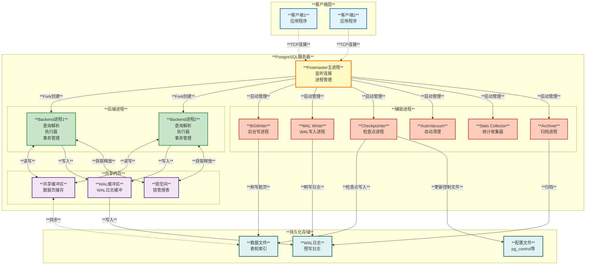
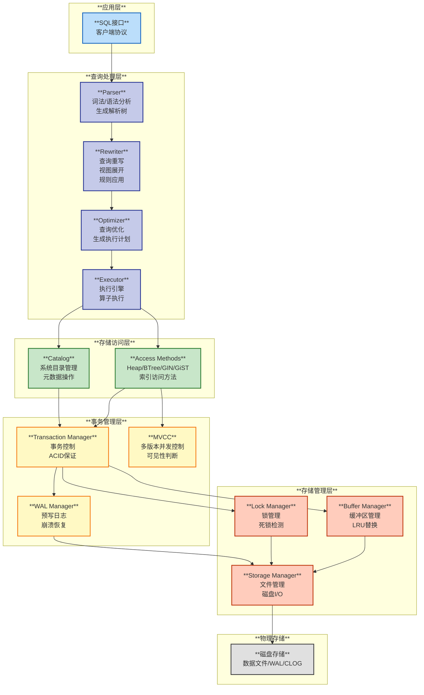
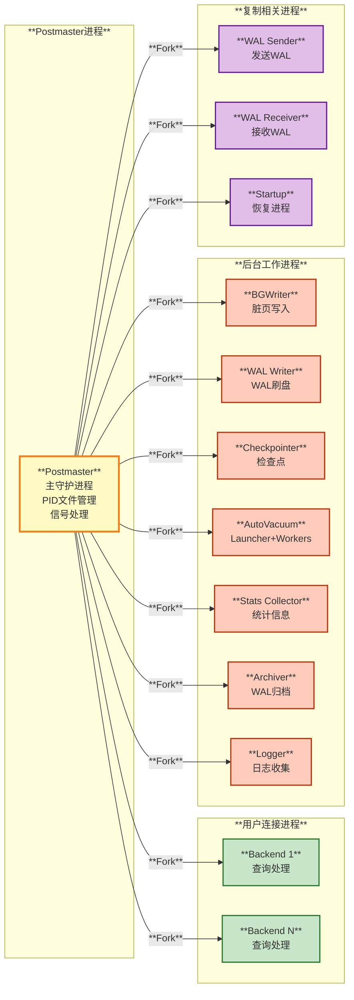
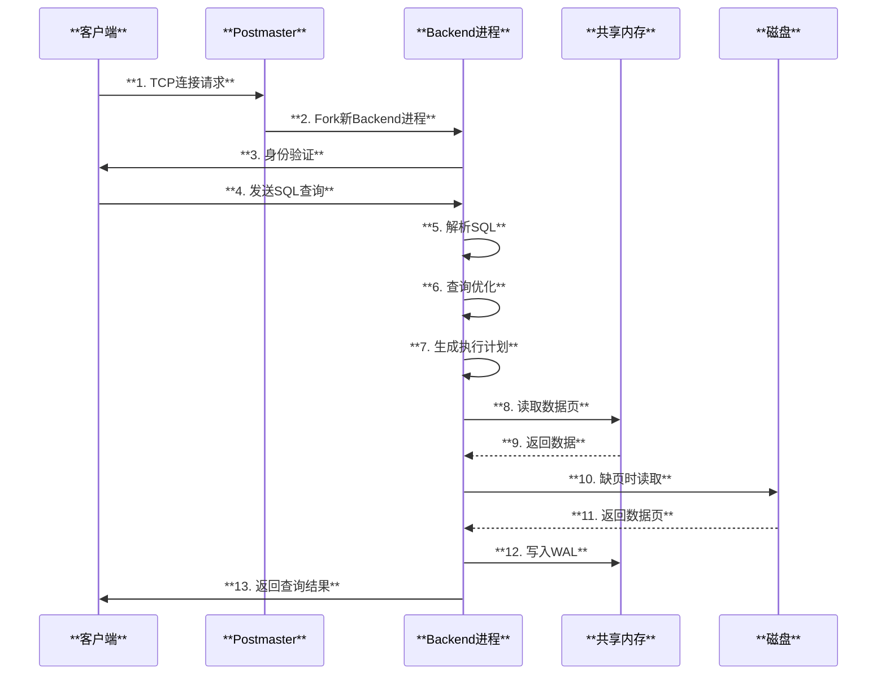
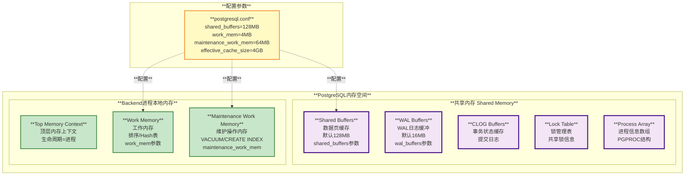
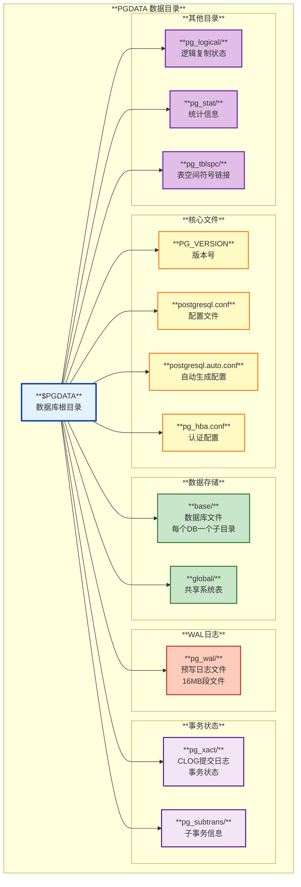
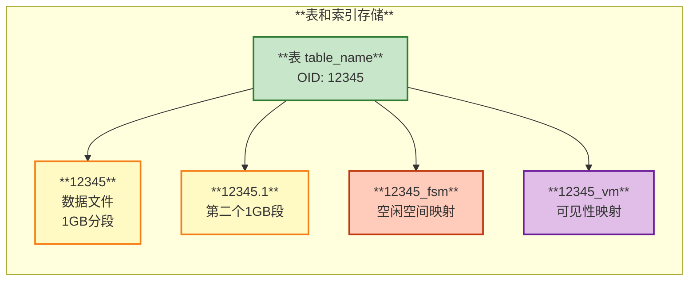
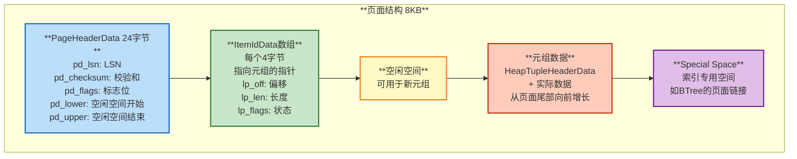

# PostgreSQL 架构总览

## 目录
- [1. 系统架构](#1-系统架构)
- [2. 核心模块](#2-核心模块)
- [3. 进程架构](#3-进程架构)
- [4. 内存架构](#4-内存架构)
- [5. 存储架构](#5-存储架构)

---

## 1. 系统架构

PostgreSQL 是一个客户端-服务器架构的关系型数据库管理系统。它采用多进程架构，每个客户端连接对应一个独立的后端进程。

### 1.1 整体架构图



### 1.2 架构特点

#### **多进程模型**
- **Postmaster主进程**: 系统守护进程，负责监听连接请求和管理所有子进程
- **Backend进程**: 每个客户端连接对应一个独立的Backend进程，完全隔离
- **辅助进程**: 专职后台任务，如WAL写入、检查点、统计收集等

#### **优点**
- **稳定性高**: 单个Backend崩溃不影响其他连接
- **安全性强**: 进程间完全隔离，内存保护
- **简化并发**: 避免复杂的线程同步问题

#### **缺点**
- **连接开销大**: 每个连接需要fork新进程（通常使用连接池解决）
- **内存开销**: 每个进程有独立的内存空间

---

## 2. 核心模块

PostgreSQL源码按功能划分为多个模块，主要位于`src/backend/`目录下：

### 2.1 模块分层架构



### 2.2 主要模块说明

| **模块** | **位置** | **功能描述** |
|---------|---------|-------------|
| **postmaster** | `src/backend/postmaster/` | 主进程管理，连接监听，子进程创建 |
| **parser** | `src/backend/parser/` | SQL解析，词法分析，语法分析，生成解析树 |
| **rewrite** | `src/backend/rewrite/` | 查询重写，视图展开，规则系统 |
| **optimizer** | `src/backend/optimizer/` | 查询优化，代价估算，执行计划生成 |
| **executor** | `src/backend/executor/` | 查询执行，算子实现（扫描、连接、聚合等） |
| **access** | `src/backend/access/` | 存储访问方法（heap、btree、gin等） |
| **storage** | `src/backend/storage/` | 存储管理（buffer、lock、page、smgr） |
| **transam** | `src/backend/access/transam/` | 事务管理、MVCC、WAL、CLOG |
| **catalog** | `src/backend/catalog/` | 系统目录管理，元数据操作 |
| **commands** | `src/backend/commands/` | DDL/DML命令实现 |
| **utils** | `src/backend/utils/` | 工具函数（内存管理、缓存、错误处理等） |
| **libpq** | `src/backend/libpq/` | 前后端通信协议 |
| **replication** | `src/backend/replication/` | 流复制、逻辑复制 |

---

## 3. 进程架构

### 3.1 进程类型与职责



### 3.2 关键进程详解

#### **3.2.1 Postmaster（主进程）**
**源码位置**: `src/backend/postmaster/postmaster.c`

**主要职责**:
- 启动时初始化共享内存和信号量
- 监听TCP端口（默认5432）接受客户端连接
- 为每个新连接Fork一个Backend进程
- 启动和管理所有辅助后台进程
- 监控子进程状态，异常时进行恢复
- 接收管理命令（启动、停止、重载配置等）

**关键代码片段**:
```c
// 来自 src/backend/postmaster/postmaster.c
/*
 * Main entry point for the Postmaster
 */
PostmasterMain(int argc, char *argv[])
{
    // 初始化共享内存
    CreateSharedMemoryAndSemaphores();
    
    // 启动辅助进程
    StartupDataBase();
    StartBackgroundWriter();
    StartCheckpointer();
    StartWalWriter();
    
    // 监听循环
    for (;;) {
        // 接受新连接
        ClientSocket = accept(ListenSocket);
        
        // Fork Backend进程
        BackendStartup(ClientSocket);
    }
}
```

#### **3.2.2 Backend（后端进程）**
**源码位置**: `src/backend/tcop/postgres.c`

**主要职责**:
- 处理单个客户端的所有SQL请求
- 执行身份验证
- 解析、优化、执行SQL查询
- 管理会话级别的资源（临时表、游标等）
- 事务控制（BEGIN、COMMIT、ROLLBACK）

**处理流程**:


#### **3.2.3 BGWriter（后台写进程）**
**源码位置**: `src/backend/postmaster/bgwriter.c`

- 定期扫描共享缓冲区，将脏页写入磁盘
- 减少Backend进程的I/O负担
- 平滑I/O压力，避免检查点时的I/O峰值

#### **3.2.4 WAL Writer（WAL写进程）**
**源码位置**: `src/backend/postmaster/walwriter.c`

- 定期将WAL缓冲区的日志刷写到磁盘
- 确保WAL持久化，支持崩溃恢复
- 减少Backend在提交时的等待时间

#### **3.2.5 Checkpointer（检查点进程）**
**源码位置**: `src/backend/postmaster/checkpointer.c`

- 定期执行检查点操作
- 将所有脏页刷写到磁盘
- 更新pg_control文件，记录检查点位置
- 缩短崩溃恢复时间

#### **3.2.6 AutoVacuum（自动清理）**
**源码位置**: `src/backend/postmaster/autovacuum.c`

- Launcher进程：调度Worker进程
- Worker进程：执行VACUUM操作
- 回收死元组空间
- 更新统计信息
- 防止事务ID回卷

---

## 4. 内存架构

PostgreSQL的内存分为**共享内存**和**本地内存**两大类。

### 4.1 内存布局



### 4.2 共享内存组件

| **组件** | **用途** | **配置参数** | **默认值** |
|---------|---------|-------------|-----------|
| **Shared Buffers** | 缓存数据页，减少磁盘I/O | `shared_buffers` | 128MB |
| **WAL Buffers** | 缓存WAL日志 | `wal_buffers` | 16MB（自动计算） |
| **CLOG Buffers** | 缓存事务提交状态 | 自动管理 | - |
| **Lock Space** | 存储锁信息 | `max_locks_per_transaction` | 64 |
| **Process Array** | 存储进程信息 | `max_connections` | 100 |

### 4.3 本地内存（Backend进程）

每个Backend进程有独立的内存空间：

- **TopMemoryContext**: 顶层内存上下文，生命周期等于进程
- **CacheMemoryContext**: 缓存系统目录信息
- **MessageContext**: 处理客户端消息
- **TransactionContext**: 事务级别内存，事务结束时释放
- **ExecutorContext**: 查询执行期间的内存
- **Work Memory**: 排序、Hash Join等操作的工作内存（`work_mem`）

---

## 5. 存储架构

### 5.1 数据目录结构



### 5.2 表文件组织

每个表对应一个或多个文件：



**文件命名规则**:
- **数据文件**: `OID` （超过1GB时分段为 `OID.1`, `OID.2` ...）
- **FSM文件**: `OID_fsm` （Free Space Map，记录空闲空间）
- **VM文件**: `OID_vm` （Visibility Map，用于VACUUM优化）
- **索引文件**: 同样使用OID命名

### 5.3 页面结构

PostgreSQL以页面（Page/Block）为基本I/O单位，默认8KB。



**页头关键字段**:
- **pd_lsn**: 最后修改该页的WAL日志位置（Log Sequence Number）
- **pd_checksum**: 页面校验和，用于检测数据损坏
- **pd_lower**: ItemId数组的结束位置
- **pd_upper**: 空闲空间的结束位置（元组数据的起始位置）

---

## 总结

PostgreSQL采用经典的**多进程、共享内存**架构：

1. **进程架构**: Postmaster主进程 + Backend进程 + 辅助后台进程
2. **模块分层**: 查询处理层 → 存储访问层 → 事务管理层 → 存储管理层
3. **内存管理**: 共享内存（Shared Buffers、WAL Buffers）+ 进程本地内存
4. **存储组织**: 数据目录 → 数据库子目录 → 表文件（OID） → 页面（8KB）

这种架构带来了高稳定性、强隔离性和良好的可维护性，是PostgreSQL可靠性的基础。

---

**相关文档**:
- [02-存储引擎和MVCC](./02-存储引擎和MVCC.md)
- [03-事务系统](./03-事务系统.md)
- [04-WAL和崩溃恢复](./04-WAL和崩溃恢复.md)
- [09-网络模型和进程架构](./09-网络模型和进程架构.md)

