# PostgreSQL 存储引擎和MVCC

## 目录
- [1. 存储引擎概述](#1-存储引擎概述)
- [2. Heap存储引擎](#2-heap存储引擎)
- [3. MVCC多版本并发控制](#3-mvcc多版本并发控制)
- [4. 元组可见性判断](#4-元组可见性判断)
- [5. VACUUM机制](#5-vacuum机制)
- [6. 索引访问方法](#6-索引访问方法)

---

## 1. 存储引擎概述

PostgreSQL采用**插件式存储引擎**架构，但默认且最主要的是**Heap堆表**存储引擎。

### 1.1 存储引擎架构

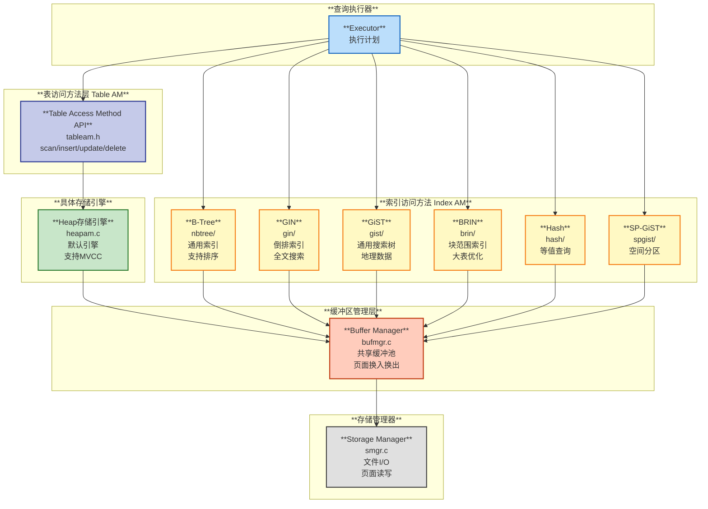

---

## 2. Heap存储引擎

### 2.1 Heap表的存储结构

PostgreSQL的Heap表是一种**堆组织表**（Heap-Organized Table），数据以无序方式存储，不按主键聚簇。

#### **页面结构**

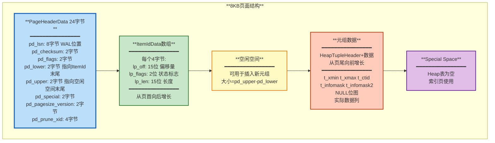

### 2.2 元组结构（HeapTuple）

**源码位置**: `src/include/access/htup_details.h`

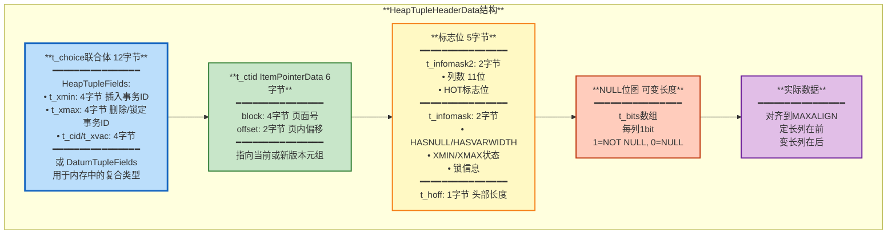

#### **关键字段说明**

| **字段** | **大小** | **说明** |
|---------|---------|---------|
| **t_xmin** | 4字节 | 插入该元组的事务ID，用于判断元组对当前事务是否可见 |
| **t_xmax** | 4字节 | 删除或锁定该元组的事务ID。0表示未删除 |
| **t_cid** | 4字节 | 命令ID（Command ID），在单个事务内区分不同SQL语句 |
| **t_ctid** | 6字节 | 指向当前版本或更新后的新版本元组位置（用于MVCC链） |
| **t_infomask** | 2字节 | 状态标志位：是否有NULL、XMIN/XMAX状态、锁信息等 |
| **t_infomask2** | 2字节 | 列数（11位）+ HOT更新标志 |
| **t_hoff** | 1字节 | 头部长度（包括NULL位图），实际数据从此偏移开始 |

### 2.3 元组的生命周期

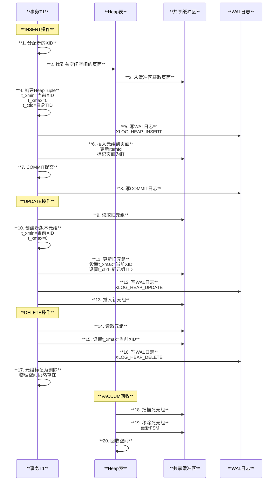

---

## 3. MVCC多版本并发控制

PostgreSQL的MVCC实现是其核心特性之一，允许读不阻塞写、写不阻塞读。

### 3.1 MVCC原理

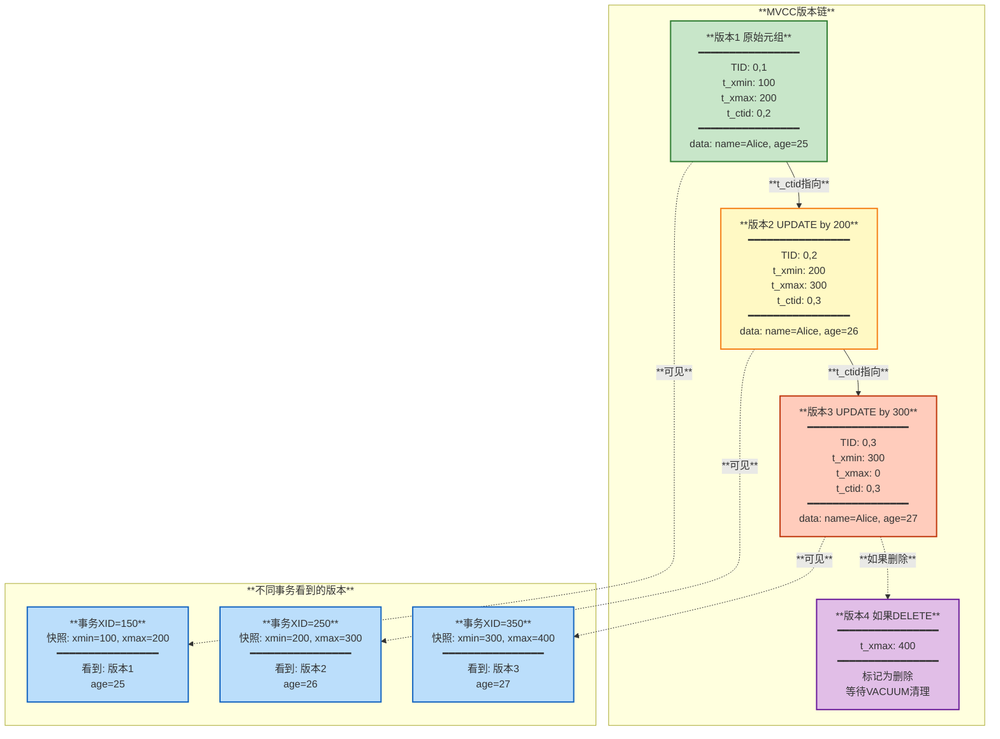

### 3.2 事务快照（Snapshot）

每个事务开始时获取一个快照，记录当前活跃事务的状态。

**源码位置**: `src/include/utils/snapshot.h`

```c
typedef struct SnapshotData {
    TransactionId xmin;    // 最小活跃事务ID，小于它的都已提交或回滚
    TransactionId xmax;    // 下一个要分配的事务ID
    TransactionId *xip;    // 活跃事务ID数组
    uint32 xcnt;           // 活跃事务数量
    // ...
} SnapshotData;
```

### 3.3 可见性判断流程

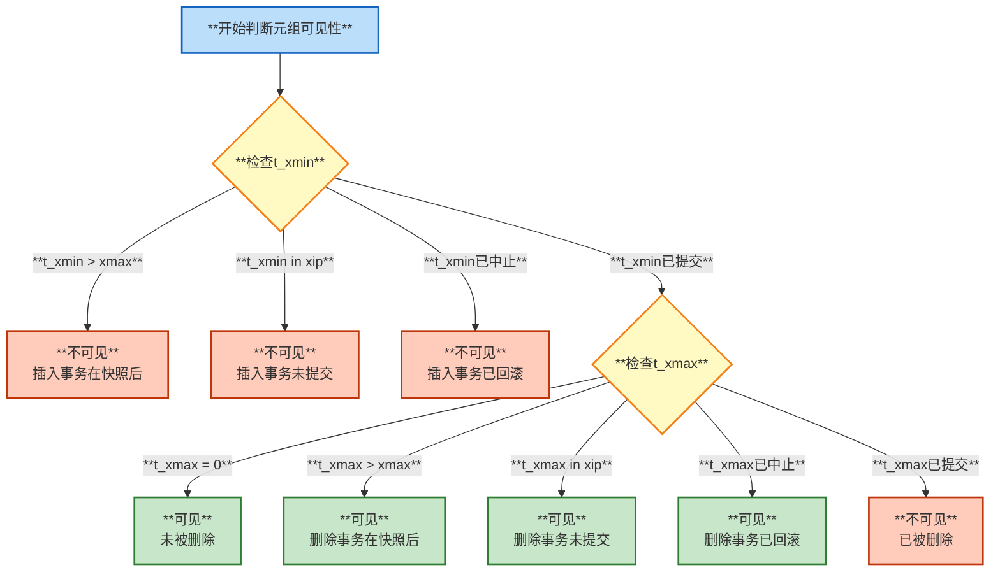

**关键函数**: `HeapTupleSatisfiesMVCC()` 在 `src/backend/access/heap/heapam_visibility.c`

---

## 4. 元组可见性判断

### 4.1 CLOG（提交日志）

PostgreSQL使用CLOG来记录事务的提交状态。

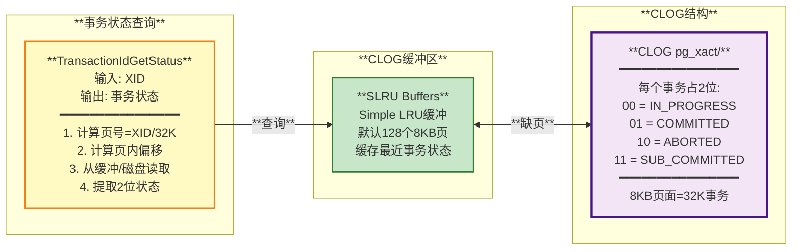

### 4.2 可见性规则矩阵

| **元组状态** | **t_xmin状态** | **t_xmax状态** | **是否可见** | **说明** |
|-------------|---------------|---------------|-------------|---------|
| **新插入** | IN_PROGRESS（当前事务） | 0 | 是（当前事务）<br/>否（其他事务） | 自己插入的可见 |
| **已提交** | COMMITTED（<xmin） | 0 | 是 | 正常可见 |
| **已删除** | COMMITTED（<xmin） | COMMITTED（<xmin） | 否 | 已删除不可见 |
| **正在删除** | COMMITTED（<xmin） | IN_PROGRESS | 是（非删除事务）<br/>否（删除事务） | 删除未提交 |
| **删除已回滚** | COMMITTED（<xmin） | ABORTED | 是 | 删除失败，仍可见 |
| **未来版本** | >xmax | - | 否 | 快照后创建的 |

---

## 5. VACUUM机制

由于MVCC会产生大量过时元组（死元组），PostgreSQL需要VACUUM来回收空间。

### 5.1 VACUUM工作原理

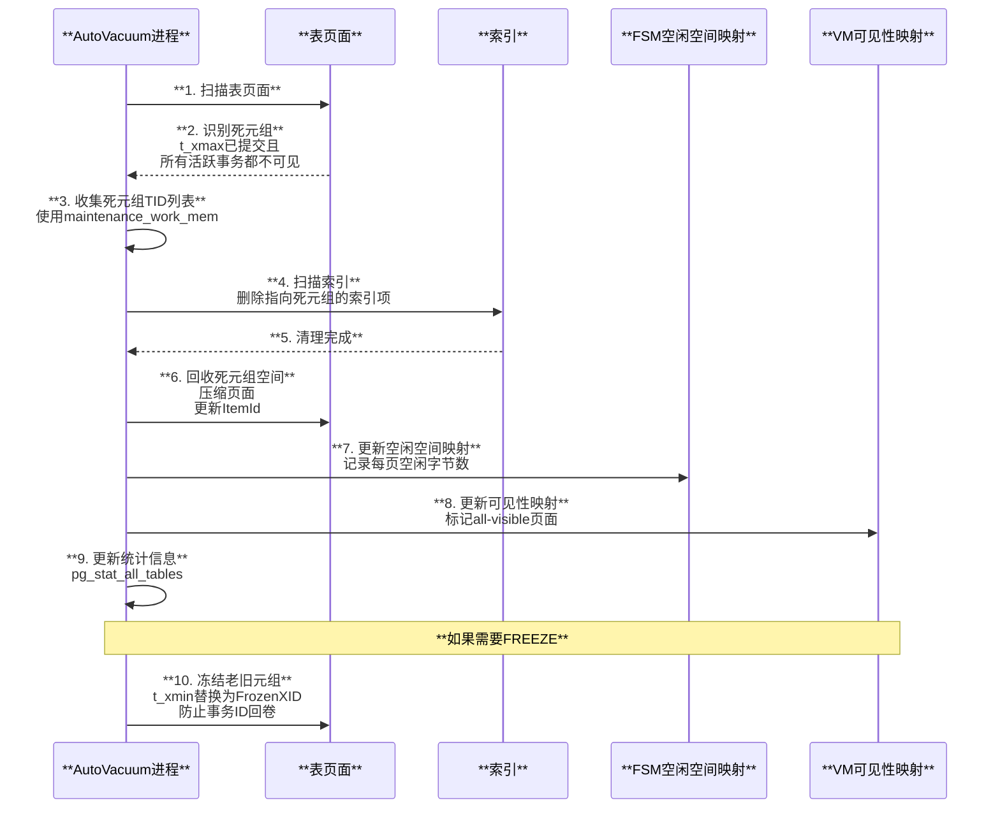

### 5.2 VACUUM类型

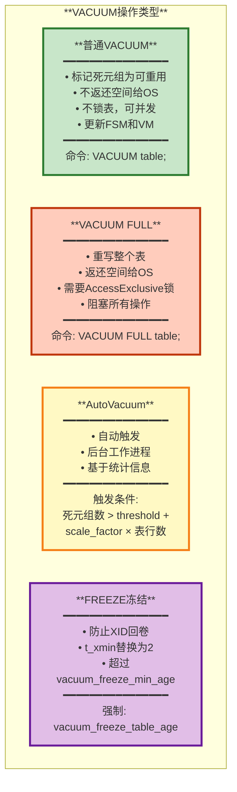

### 5.3 HOT（Heap-Only Tuple）优化

当UPDATE不修改索引列时，PostgreSQL使用HOT优化避免更新索引。

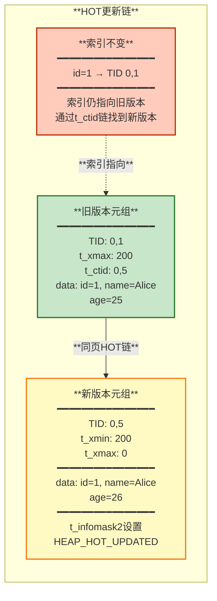

**HOT的优点**:
- 避免索引膨胀
- 减少索引更新开销
- 加快UPDATE性能

**HOT的条件**:
- 新旧版本在同一页面内
- 页面有足够空闲空间
- 没有更新索引列

---

## 6. 索引访问方法

PostgreSQL支持多种索引类型，每种适用于不同场景。

### 6.1 索引类型对比

```mermaid
graph TB
    subgraph "**PostgreSQL索引类型**"
        subgraph "**B-Tree索引**"
            style BT fill:#c8e6c9,stroke:#2e7d32,stroke-width:3px
            BT[**B-Tree**<br/>━━━━━━━━━━━━━━━━<br/>• 最常用的索引<br/>• 支持<、<=、=、>=、>、BETWEEN<br/>• 支持ORDER BY<br/>• 支持UNIQUE约束<br/>━━━━━━━━━━━━━━━━<br/>使用场景:<br/>通用查询、排序、范围查询<br/>━━━━━━━━━━━━━━━━<br/>实现: src/backend/access/nbtree/]
        end
        
        subgraph "**GIN索引**"
            style GIN fill:#fff9c4,stroke:#f57f17,stroke-width:3px
            GIN[**GIN倒排索引**<br/>━━━━━━━━━━━━━━━━<br/>• Generalized Inverted Index<br/>• 一个值对应多个行<br/>• 支持数组、全文搜索、jsonb<br/>━━━━━━━━━━━━━━━━<br/>使用场景:<br/>全文搜索、数组包含查询<br/>jsonb键值查询<br/>━━━━━━━━━━━━━━━━<br/>操作符: @>、<@、&&、@?]
        end
        
        subgraph "**GiST索引**"
            style GIST fill:#ffccbc,stroke:#bf360c,stroke-width:3px
            GIST[**GiST通用搜索树**<br/>━━━━━━━━━━━━━━━━<br/>• Generalized Search Tree<br/>• 平衡树结构<br/>• 支持空间数据、范围类型<br/>━━━━━━━━━━━━━━━━<br/>使用场景:<br/>地理位置查询PostGIS<br/>范围类型重叠查询<br/>━━━━━━━━━━━━━━━━<br/>操作符: <<、>>、&&、@>]
        end
        
        subgraph "**BRIN索引**"
            style BRIN fill:#e1bee7,stroke:#6a1b9a,stroke-width:3px
            BRIN[**BRIN块范围索引**<br/>━━━━━━━━━━━━━━━━<br/>• Block Range Index<br/>• 存储块范围的最小/最大值<br/>• 索引体积极小<br/>━━━━━━━━━━━━━━━━<br/>使用场景:<br/>大表时间序列数据<br/>物理顺序与逻辑顺序一致<br/>━━━━━━━━━━━━━━━━<br/>适用: 日志表、时间戳列]
        end
        
        subgraph "**Hash索引**"
            style HASH fill:#b3e5fc,stroke:#0277bd,stroke-width:3px
            HASH[**Hash索引**<br/>━━━━━━━━━━━━━━━━<br/>• 哈希表实现<br/>• 仅支持等值查询<br/>• 不支持排序<br/>━━━━━━━━━━━━━━━━<br/>使用场景:<br/>精确匹配查询<br/>不需要范围查询<br/>━━━━━━━━━━━━━━━━<br/>操作符: =]
        end
        
        subgraph "**SP-GiST索引**"
            style SPGIST fill:#dcedc8,stroke:#558b2f,stroke-width:3px
            SPGIST[**SP-GiST空间分区**<br/>━━━━━━━━━━━━━━━━<br/>• Space-Partitioned GiST<br/>• 非平衡树<br/>• 支持四叉树、k-d树<br/>━━━━━━━━━━━━━━━━<br/>使用场景:<br/>电话号码、IP地址<br/>空间分区数据]
        end
    end
```

### 6.2 索引选择指南

| **场景** | **推荐索引** | **示例** |
|---------|-------------|---------|
| 通用查询、排序 | **B-Tree** | `CREATE INDEX ON users(name);` |
| 全文搜索 | **GIN** | `CREATE INDEX ON docs USING GIN(to_tsvector('english', content));` |
| 数组查询 | **GIN** | `CREATE INDEX ON posts USING GIN(tags);` |
| JSONB查询 | **GIN** | `CREATE INDEX ON data USING GIN(json_col);` |
| 地理位置 | **GiST** | `CREATE INDEX ON places USING GIST(location);` |
| 大表时间序列 | **BRIN** | `CREATE INDEX ON logs USING BRIN(created_at);` |
| 仅等值查询 | **Hash** | `CREATE INDEX ON cache USING HASH(key);` |

---

## 总结

PostgreSQL的存储引擎和MVCC机制是其高性能和高并发的基础：

1. **Heap存储**: 堆组织表，页面+元组结构，支持高效的顺序扫描
2. **MVCC**: 通过元组多版本实现读写不阻塞，每个事务看到一致的快照
3. **可见性判断**: 基于t_xmin、t_xmax和事务快照判断元组是否可见
4. **VACUUM**: 回收死元组空间，防止表膨胀和事务ID回卷
5. **多种索引**: B-Tree、GIN、GiST、BRIN等满足不同查询需求

**关键优势**:
- **并发性高**: 读不阻塞写，写不阻塞读
- **一致性强**: 每个事务看到一致的数据快照
- **灵活性强**: 支持多种索引类型和访问方法

**代价**:
- **空间开销**: 需要存储多版本元组
- **维护成本**: 需要定期VACUUM清理死元组

---

**相关文档**:
- [01-架构总览](./01-架构总览.md)
- [03-事务系统](./03-事务系统.md)
- [04-WAL和崩溃恢复](./04-WAL和崩溃恢复.md)

