# PostgreSQL 事务系统

## 目录
- [1. 事务概述](#1-事务概述)
- [2. 事务ID管理](#2-事务id管理)
- [3. 事务隔离级别](#3-事务隔离级别)
- [4. 锁机制](#4-锁机制)
- [5. 死锁检测](#5-死锁检测)
- [6. 两阶段提交](#6-两阶段提交)

---

## 1. 事务概述

PostgreSQL完整支持ACID特性（原子性、一致性、隔离性、持久性），是企业级数据库的核心能力。

### 1.1 ACID实现机制

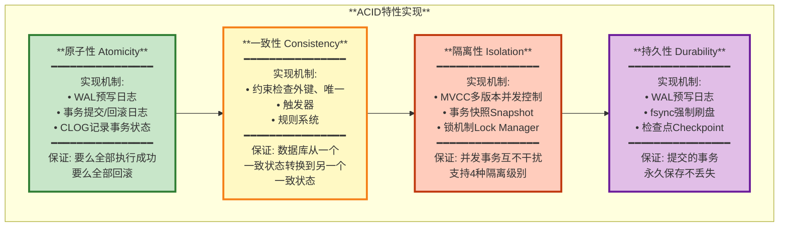

### 1.2 事务处理流程

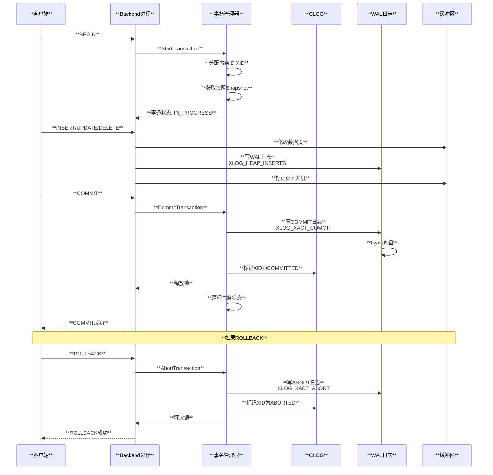

---

## 2. 事务ID管理

### 2.1 事务ID（XID）分配

PostgreSQL使用32位无符号整数作为事务ID，范围是0到2^32-1（约42亿）。

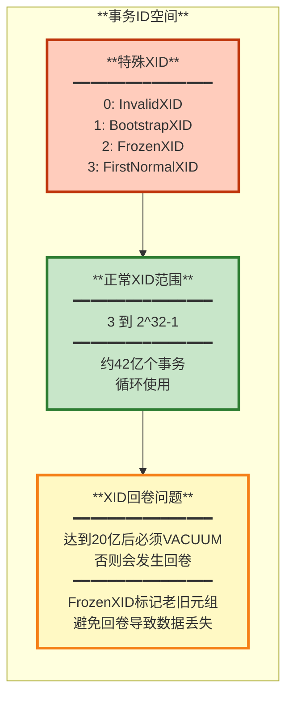

### 2.2 XID比较规则

由于XID是循环使用的，不能简单用数值大小比较，而是使用模运算。

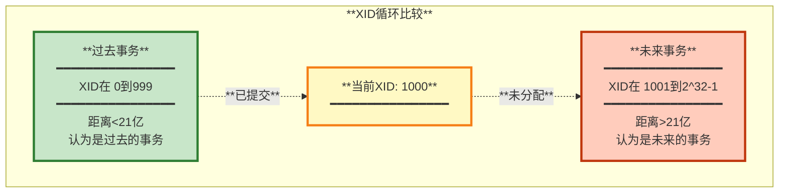

**关键函数**: `TransactionIdPrecedes()` 在 `src/include/access/transam.h`

```c
// 判断xid1是否在xid2之前
bool TransactionIdPrecedes(TransactionId xid1, TransactionId xid2)
{
    int32 diff = (int32)(xid1 - xid2);
    return (diff < 0);
}
```

### 2.3 事务ID冻结

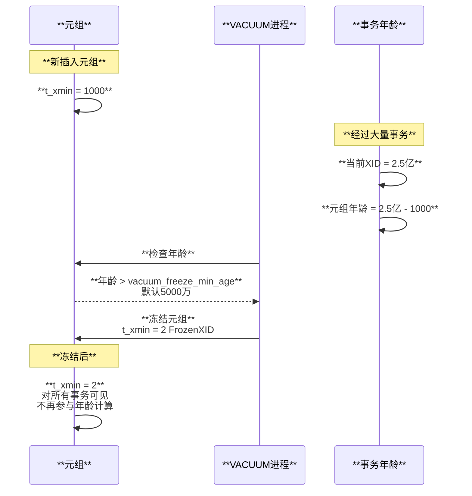

**配置参数**:
- `vacuum_freeze_min_age`: 默认50,000,000（5千万）
- `vacuum_freeze_table_age`: 默认150,000,000（1.5亿）
- `autovacuum_freeze_max_age`: 默认200,000,000（2亿，强制VACUUM）

---

## 3. 事务隔离级别

PostgreSQL支持SQL标准定义的4种隔离级别，但实际实现只有3种（READ UNCOMMITTED等同于READ COMMITTED）。

### 3.1 隔离级别对比

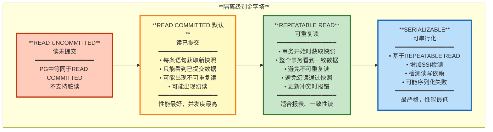

### 3.2 隔离级别现象对比表

| **隔离级别** | **脏读** | **不可重复读** | **幻读** | **序列化异常** |
|-------------|---------|---------------|---------|---------------|
| **READ UNCOMMITTED** | ❌ 不会 | ✅ 可能 | ✅ 可能 | ✅ 可能 |
| **READ COMMITTED** | ❌ 不会 | ✅ 可能 | ✅ 可能 | ✅ 可能 |
| **REPEATABLE READ** | ❌ 不会 | ❌ 不会 | ❌ 不会 | ✅ 可能 |
| **SERIALIZABLE** | ❌ 不会 | ❌ 不会 | ❌ 不会 | ❌ 不会 |

### 3.3 READ COMMITTED示例

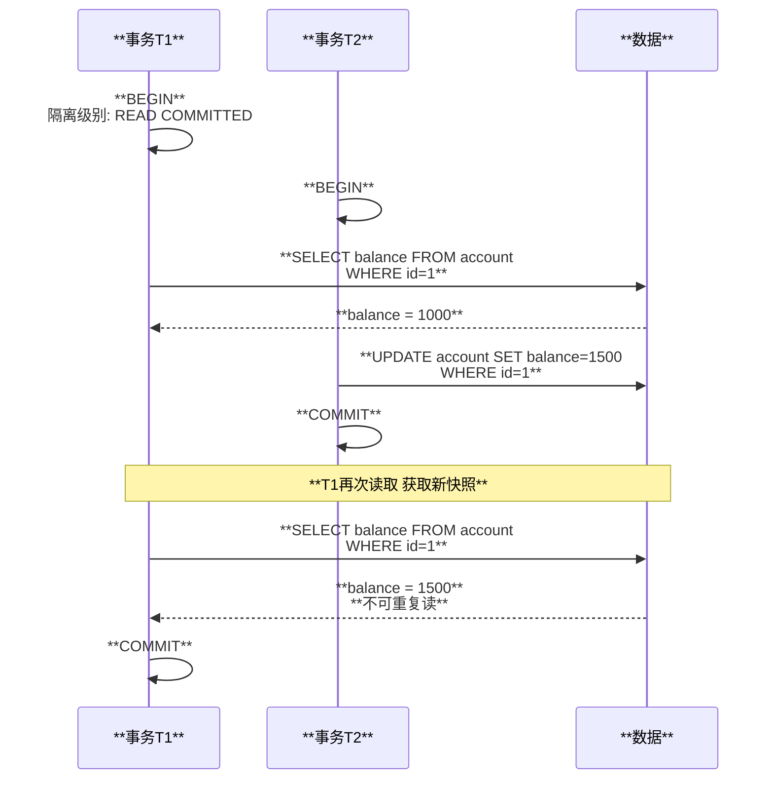

### 3.4 REPEATABLE READ示例

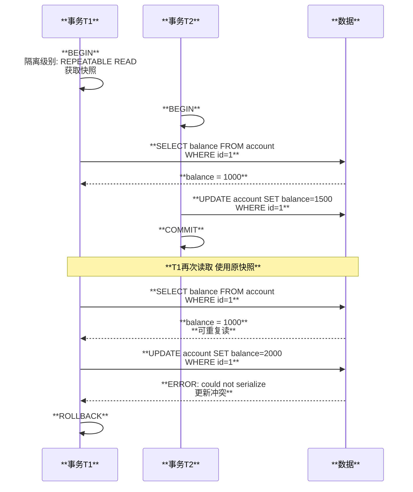

### 3.5 SERIALIZABLE与SSI

PostgreSQL使用**SSI（Serializable Snapshot Isolation）**实现可串行化隔离级别。

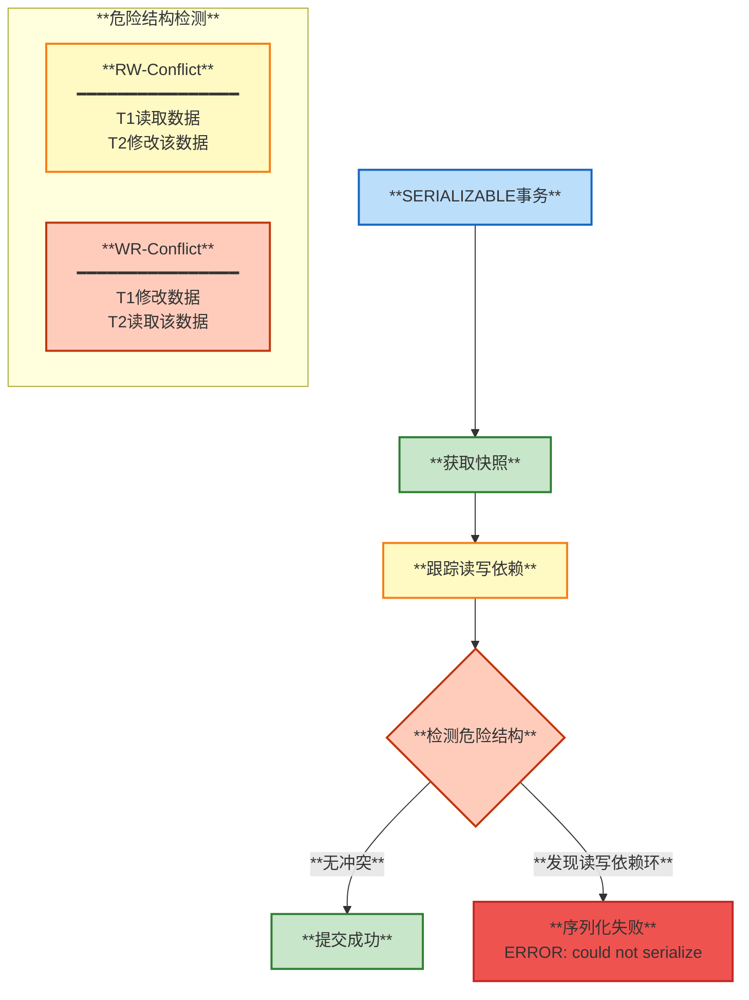

---

## 4. 锁机制

PostgreSQL有多层锁机制，从表级锁到行级锁，平衡并发性和一致性。

### 4.1 锁层次结构

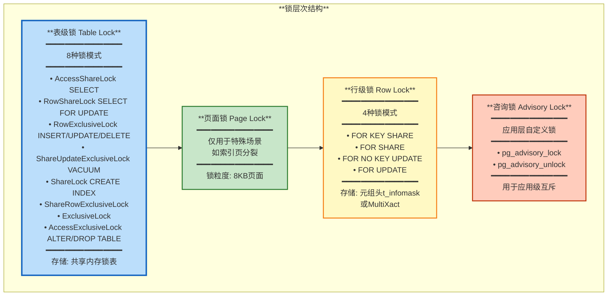

### 4.2 表锁兼容性矩阵

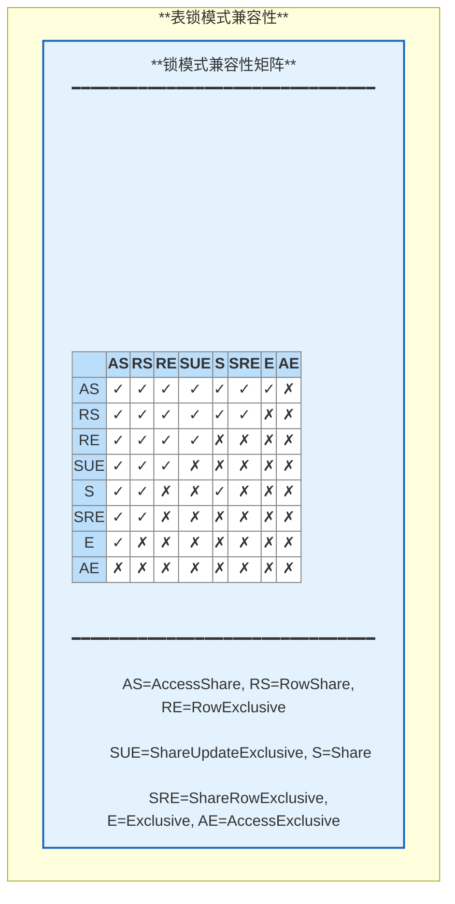

### 4.3 行级锁实现

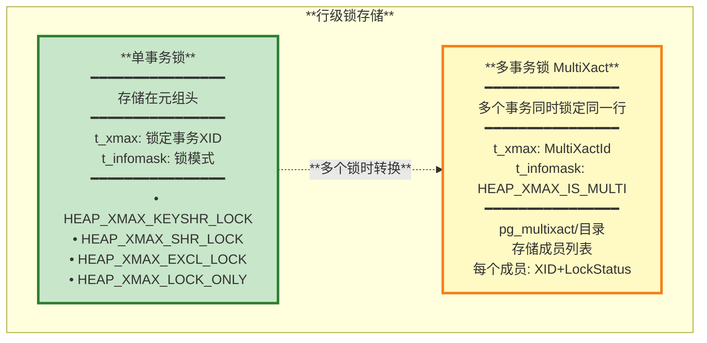

### 4.4 行锁模式

| **锁模式** | **SQL命令** | **冲突锁** | **用途** |
|-----------|-----------|-----------|---------|
| **FOR KEY SHARE** | `SELECT ... FOR KEY SHARE` | FOR UPDATE | 防止删除和主键修改 |
| **FOR SHARE** | `SELECT ... FOR SHARE` | FOR UPDATE<br/>FOR NO KEY UPDATE | 防止修改和删除 |
| **FOR NO KEY UPDATE** | `SELECT ... FOR NO KEY UPDATE` | FOR SHARE<br/>FOR NO KEY UPDATE<br/>FOR UPDATE | 防止修改和删除，允许键共享 |
| **FOR UPDATE** | `SELECT ... FOR UPDATE`<br/>UPDATE/DELETE | 所有其他锁 | 独占锁，防止任何修改 |

---

## 5. 死锁检测

PostgreSQL使用**等待图（Wait-For Graph）**算法检测死锁。

### 5.1 死锁检测机制

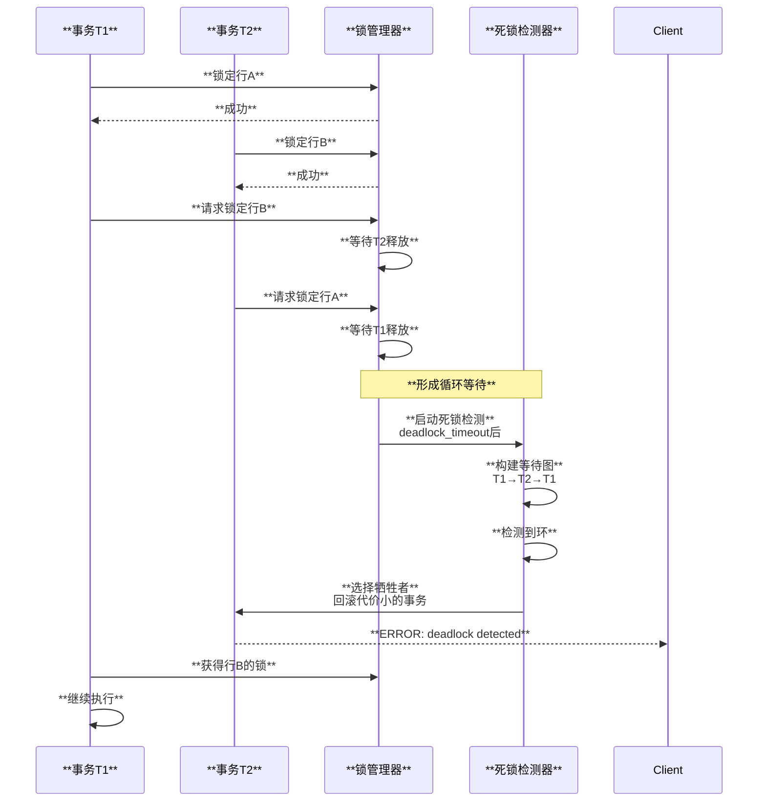

### 5.2 等待图构建

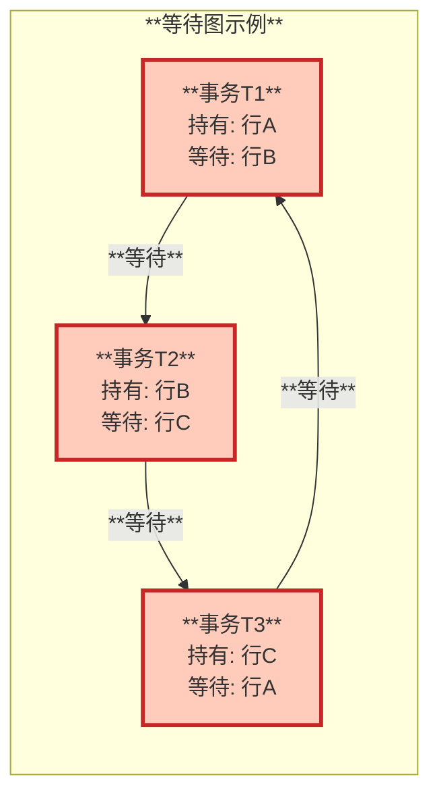

### 5.3 避免死锁的最佳实践

1. **按相同顺序访问对象**: 所有事务按ID排序访问行
2. **缩短事务时间**: 减少锁持有时间
3. **使用较低隔离级别**: READ COMMITTED而非SERIALIZABLE
4. **使用SELECT FOR UPDATE NOWAIT**: 立即失败而非等待
5. **合理设置超时**: `deadlock_timeout`（默认1秒）

---

## 6. 两阶段提交

两阶段提交（2PC）用于分布式事务，确保跨多个数据库的事务原子性。

### 6.1 2PC流程

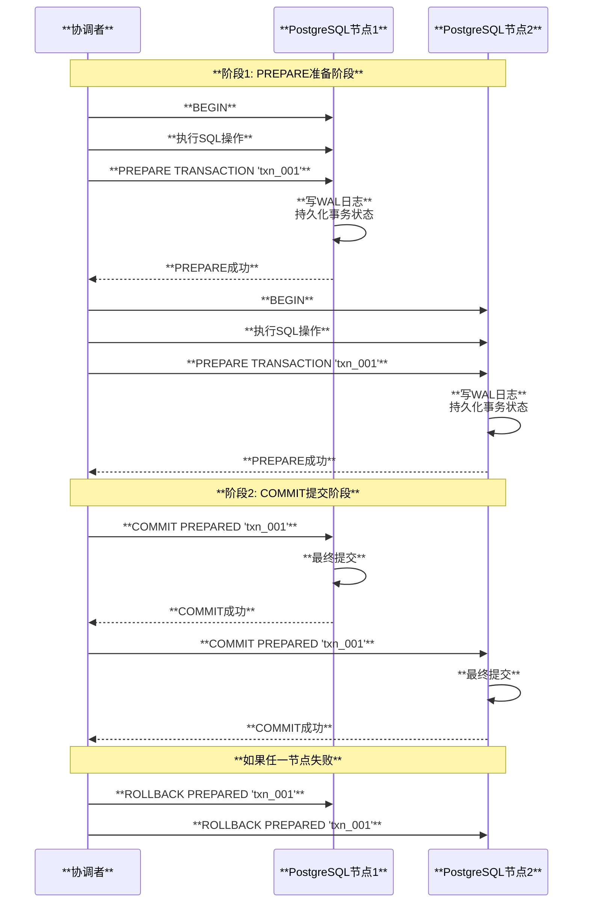

### 6.2 2PC状态管理

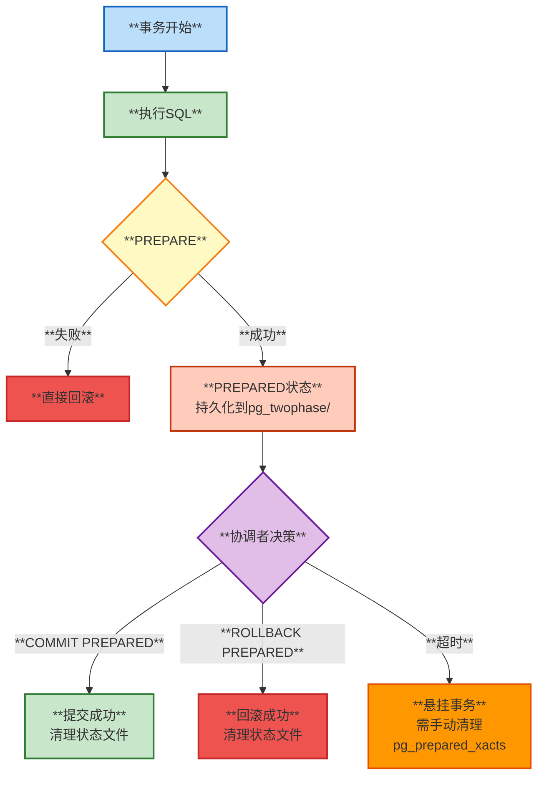

### 6.3 查看准备的事务

```sql
-- 查看所有准备的事务
SELECT * FROM pg_prepared_xacts;

-- 手动提交/回滚
COMMIT PREPARED 'txn_001';
ROLLBACK PREPARED 'txn_001';
```

---

## 总结

PostgreSQL的事务系统是其ACID保证的核心：

1. **完整的ACID支持**: 通过WAL、MVCC、锁机制和CLOG实现
2. **灵活的隔离级别**: 支持4种隔离级别，默认READ COMMITTED
3. **高效的锁机制**: 多层次锁（表锁、页锁、行锁）平衡并发性
4. **智能死锁检测**: 自动检测和解决死锁问题
5. **分布式事务支持**: 通过2PC实现跨库事务

**关键特性**:
- **事务ID循环使用**: 需要VACUUM FREEZE防止回卷
- **MVCC实现隔离**: 读不阻塞写，写不阻塞读
- **行级锁存储在元组头**: 避免额外的锁表查找
- **SSI实现可串行化**: 检测读写依赖，避免异常

**配置建议**:
- `default_transaction_isolation`: 默认READ COMMITTED
- `deadlock_timeout`: 死锁检测延迟，默认1秒
- `max_prepared_transactions`: 2PC最大数量，默认0（禁用）

---

**相关文档**:
- [01-架构总览](./01-架构总览.md)
- [02-存储引擎和MVCC](./02-存储引擎和MVCC.md)
- [04-WAL和崩溃恢复](./04-WAL和崩溃恢复.md)

