# PostgreSQL WAL和崩溃恢复

## 目录
- [1. WAL概述](#1-wal概述)
- [2. WAL结构](#2-wal结构)
- [3. WAL写入流程](#3-wal写入流程)
- [4. 检查点机制](#4-检查点机制)
- [5. 崩溃恢复](#5-崩溃恢复)
- [6. WAL归档](#6-wal归档)

---

## 1. WAL概述

**WAL（Write-Ahead Logging，预写日志）**是PostgreSQL实现ACID中持久性（Durability）的核心机制。

### 1.1 WAL基本原理

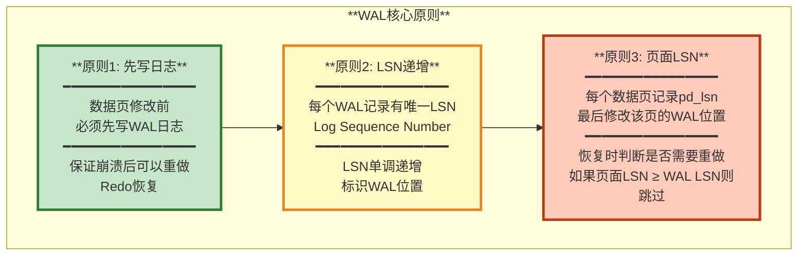

### 1.2 WAL的作用

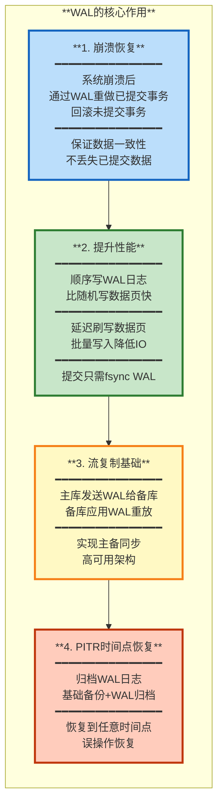

---

## 2. WAL结构

### 2.1 WAL文件组织

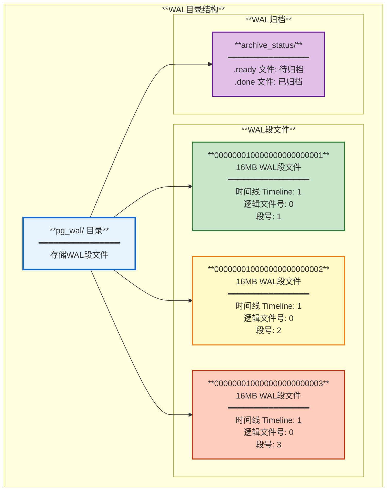

**文件命名规则**:
- 文件名长度: 24个十六进制字符
- 格式: `TTTTTTTLLLLLLLLSSSSSSSS`
  - `TTTTTTTT`: 8位时间线ID（Timeline）
  - `LLLLLLLL`: 8位逻辑文件号
  - `SSSSSSSS`: 8位段号
- 示例: `000000010000000000000001`
  - Timeline = 1
  - 逻辑文件号 = 0
  - 段号 = 1

### 2.2 WAL记录结构

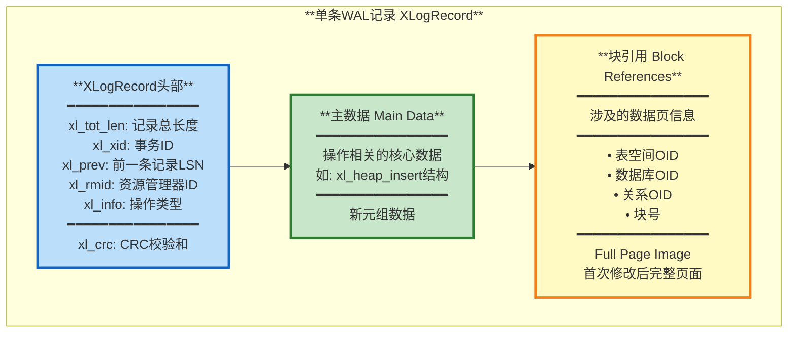

### 2.3 LSN结构

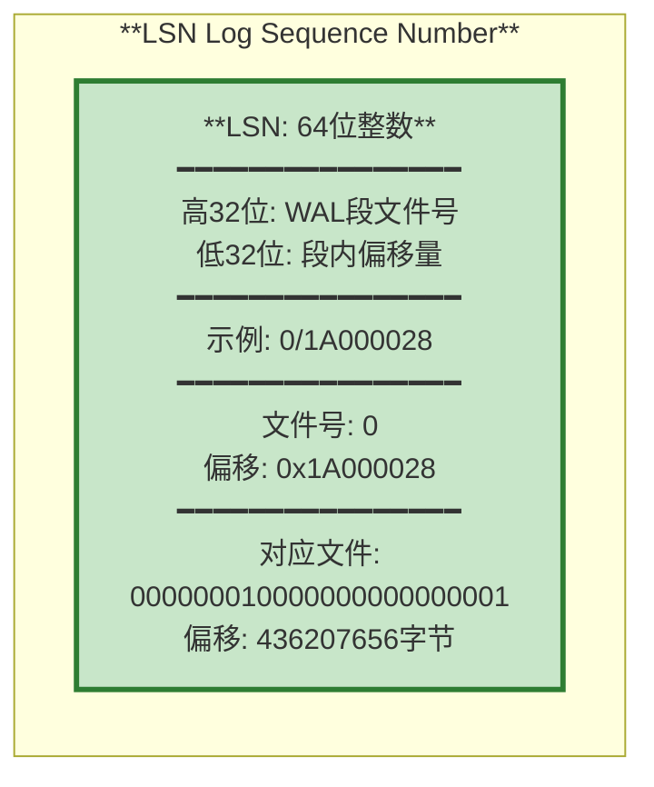

---

## 3. WAL写入流程

### 3.1 完整的WAL写入过程

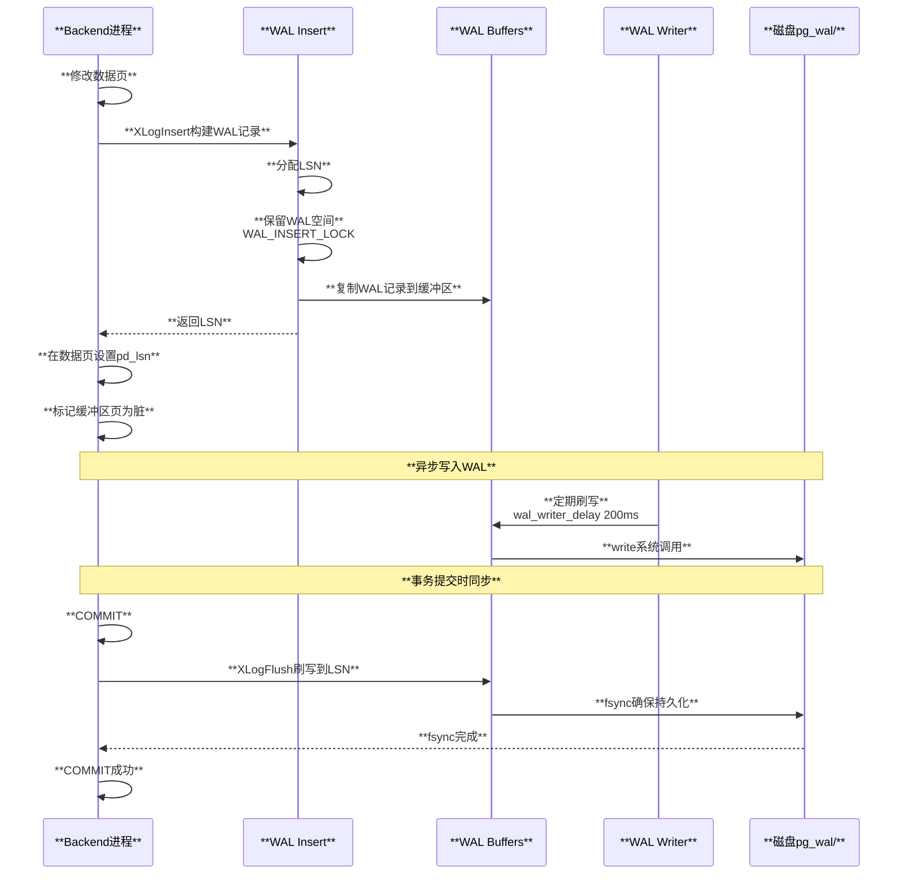

### 3.2 WAL Buffers管理

```mermaid
graph TB
    subgraph "**WAL缓冲区**"
        style Buffer fill:#c8e6c9,stroke:#2e7d32,stroke-width:3px
        
        Buffer[**WAL Buffers**<br/>━━━━━━━━━━━━━━━━<br/>共享内存中的环形缓冲区<br/>默认大小: 16MB<br/>配置参数: wal_buffers<br/>━━━━━━━━━━━━━━━━<br/>多个8KB页面<br/>━━━━━━━━━━━━━━━━<br/>LSN范围: [写入位置, 刷盘位置]]
        
        subgraph "**缓冲区状态**"
            style Insert fill:#bbdefb,stroke:#1565c0,stroke-width:2px
            style Write fill:#fff9c4,stroke:#f57f17,stroke-width:2px
            style Flush fill:#ffccbc,stroke:#bf360c,stroke-width:2px
            
            Insert[**Insert Pointer**<br/>当前插入位置]
            Write[**Write Pointer**<br/>已写入磁盘位置]
            Flush[**Flush Pointer**<br/>已fsync位置]
        end
        
        Buffer --> Insert
        Buffer --> Write
        Buffer --> Flush
    end
    
    Insert -.->|**write**| Write
    Write -.->|**fsync**| Flush
```

### 3.3 Full Page Write（FPW）

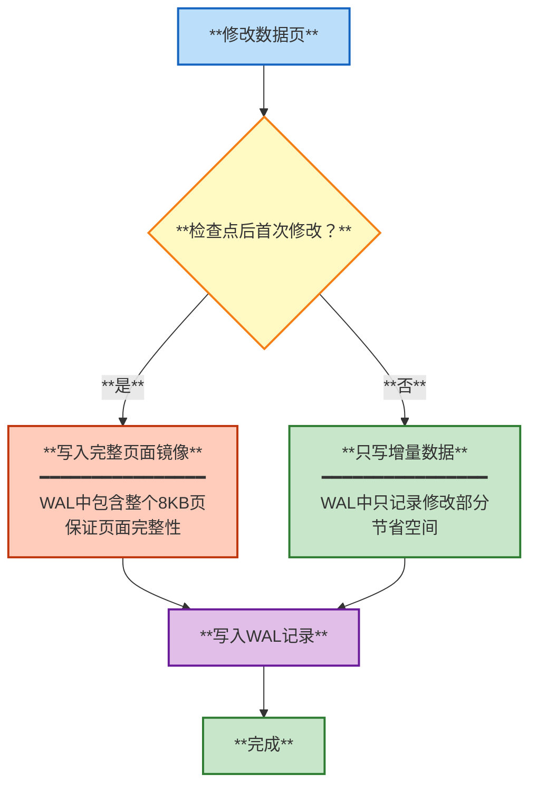

**FPW的作用**:
- 防止部分写（torn page）问题
- 操作系统页面大小（通常4KB）小于PostgreSQL页面（8KB）
- 崩溃时可能只写入页面的一部分
- FPW保证页面数据完整

**配置参数**:
- `full_page_writes`: 是否启用FPW（默认on，强烈建议开启）
- `wal_compression`: 压缩FPW数据（默认off）

---

## 4. 检查点机制

检查点（Checkpoint）是WAL管理的关键机制，定期将脏页刷写到磁盘，缩短恢复时间。

### 4.1 检查点流程

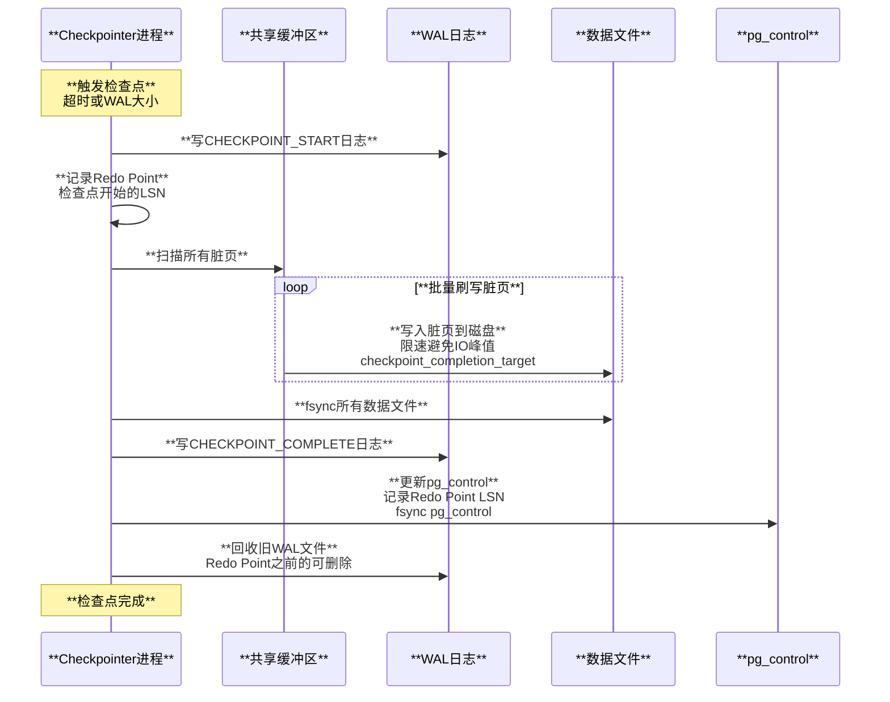

### 4.2 检查点触发条件

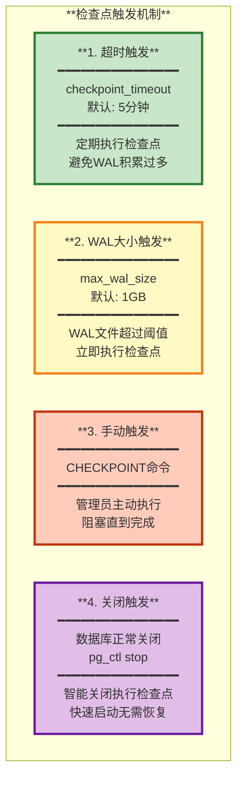

### 4.3 检查点调优

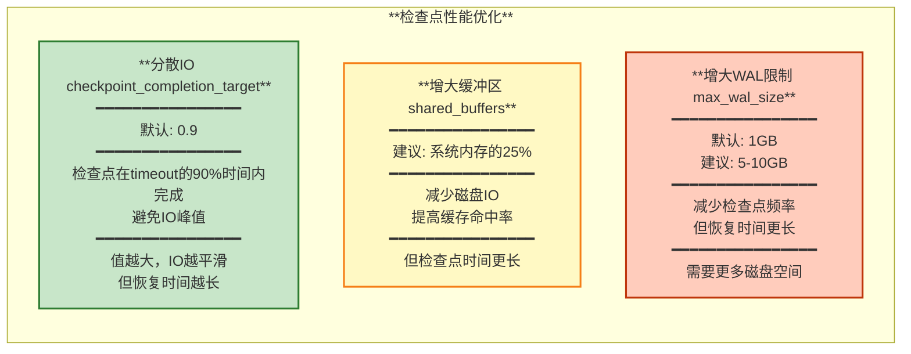

---

## 5. 崩溃恢复

### 5.1 崩溃恢复流程

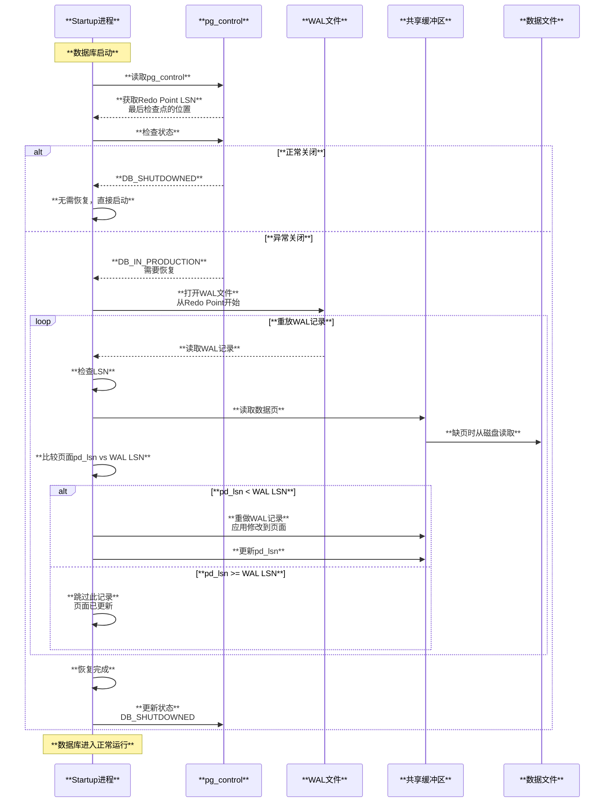

### 5.2 恢复模式

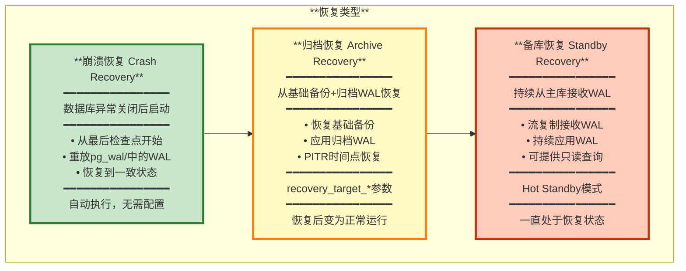

### 5.3 Redo操作类型

PostgreSQL使用**资源管理器（Resource Manager）**来处理不同类型的WAL记录。

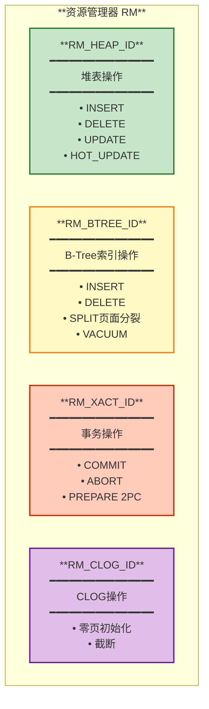

**常见资源管理器**:
| **RM ID** | **名称** | **用途** |
|----------|---------|---------|
| 0 | XLOG | WAL内部操作（检查点等） |
| 10 | Heap | 堆表操作 |
| 11 | Heap2 | 堆表其他操作（VACUUM等） |
| 2 | Btree | B-Tree索引 |
| 12 | Xact | 事务提交/回滚 |
| 0 | CLOG | 事务状态日志 |

---

## 6. WAL归档

WAL归档是实现PITR（Point-In-Time Recovery）和备份的基础。

### 6.1 WAL归档流程

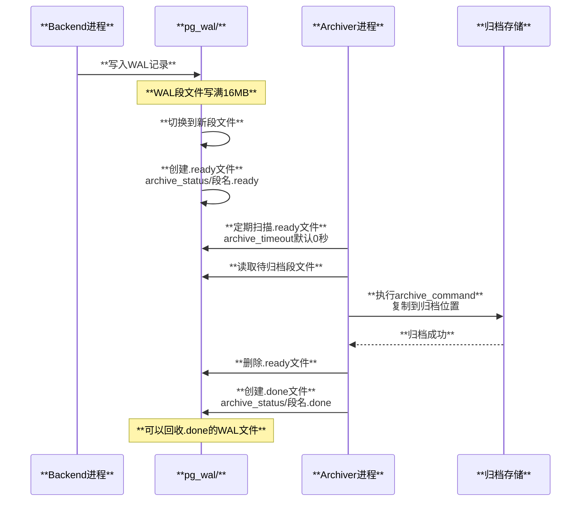

### 6.2 配置WAL归档

```ini
# postgresql.conf

# 启用归档
archive_mode = on

# 归档命令（复制到归档目录）
archive_command = 'cp %p /mnt/archive/%f'

# 归档超时（强制切换WAL段）
archive_timeout = 300  # 5分钟

# WAL级别必须为replica或logical
wal_level = replica
```

**archive_command变量**:
- `%p`: 要归档的WAL文件路径
- `%f`: WAL文件名

**常见归档命令**:
```bash
# 本地复制
archive_command = 'cp %p /mnt/archive/%f'

# 远程复制（rsync）
archive_command = 'rsync -a %p user@backup:/archive/%f'

# AWS S3
archive_command = 'aws s3 cp %p s3://my-bucket/wal/%f'

# 使用pg_receivewal（推荐）
# 独立进程持续接收WAL流
pg_receivewal -D /mnt/archive -h primary_host
```

### 6.3 PITR恢复流程

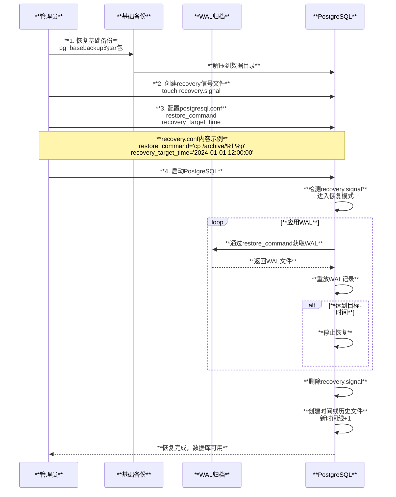

### 6.4 时间线（Timeline）

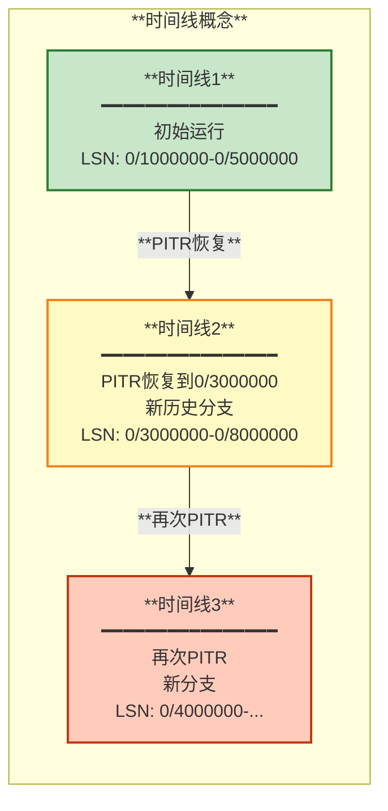

**时间线作用**:
- 避免混淆不同历史分支的WAL
- PITR后生成新时间线
- 时间线历史文件（`.history`）记录分支关系

---

## 总结

PostgreSQL的WAL和崩溃恢复机制是其持久性和可靠性的保证：

1. **WAL预写日志**: 所有修改先写日志，保证崩溃后可恢复
2. **检查点机制**: 定期刷写脏页，缩短恢复时间，回收WAL空间
3. **崩溃恢复**: 从检查点开始重放WAL，恢复到一致状态
4. **WAL归档**: 支持PITR时间点恢复和长期备份

**关键特性**:
- **Full Page Write**: 防止部分写问题
- **LSN机制**: 确保WAL顺序和页面一致性
- **资源管理器**: 模块化处理不同类型的WAL记录
- **时间线**: 支持多次PITR恢复

**性能优化**:
- `checkpoint_completion_target`: 平滑IO，避免峰值
- `max_wal_size`: 控制WAL大小和检查点频率
- `wal_buffers`: WAL缓冲区大小
- `wal_compression`: 压缩FPW节省空间

**监控指标**:
- `pg_current_wal_lsn()`: 当前WAL位置
- `pg_wal_lsn_diff()`: 计算LSN差值
- `pg_stat_bgwriter`: 检查点统计信息
- `pg_stat_archiver`: 归档进度

---

**相关文档**:
- [01-架构总览](./01-架构总览.md)
- [02-存储引擎和MVCC](./02-存储引擎和MVCC.md)
- [03-事务系统](./03-事务系统.md)
- [07-备份和复制原理](./07-备份和复制原理.md)

