# PostgreSQL 备份和复制原理

## 目录
- [1. 备份概述](#1-备份概述)
- [2. 逻辑备份](#2-逻辑备份)
- [3. 物理备份](#3-物理备份)
- [4. 流复制原理](#4-流复制原理)
- [5. 逻辑复制](#5-逻辑复制)
- [6. 复制槽](#6-复制槽)

---

## 1. 备份概述

PostgreSQL提供多种备份方法，分为**逻辑备份**和**物理备份**两大类。

### 1.1 备份类型对比

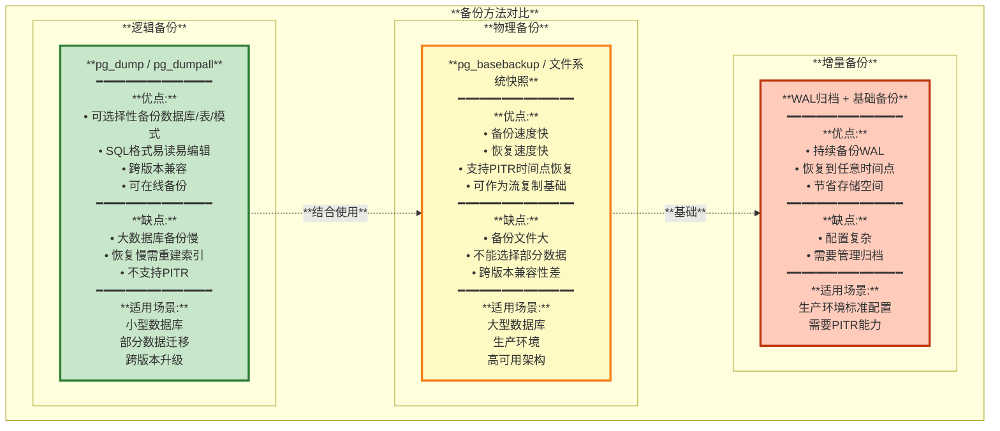

---

## 2. 逻辑备份

### 2.1 pg_dump备份流程

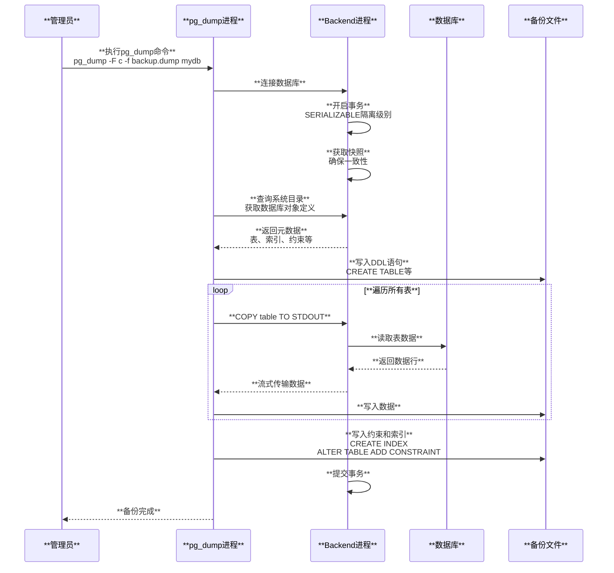

### 2.2 pg_dump常用选项

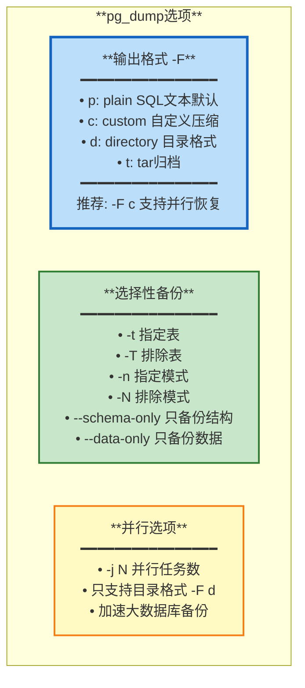

**常用命令示例**:
```bash
# 备份整个数据库（自定义格式）
pg_dump -F c -f mydb.dump mydb

# 备份指定表
pg_dump -t users -t orders -F c -f tables.dump mydb

# 只备份结构
pg_dump --schema-only -f schema.sql mydb

# 并行备份（目录格式）
pg_dump -F d -j 4 -f backup_dir mydb

# 备份所有数据库
pg_dumpall -f all_databases.sql
```

### 2.3 pg_restore恢复

```bash
# 恢复自定义格式备份
pg_restore -d newdb mydb.dump

# 并行恢复
pg_restore -j 4 -d newdb backup_dir

# 只恢复指定表
pg_restore -t users -d newdb mydb.dump

# 恢复到新数据库（先创建）
createdb newdb
pg_restore -d newdb mydb.dump
```

---

## 3. 物理备份

### 3.1 pg_basebackup工作原理

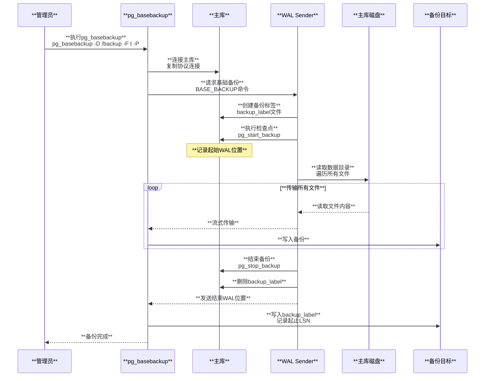

### 3.2 pg_basebackup选项

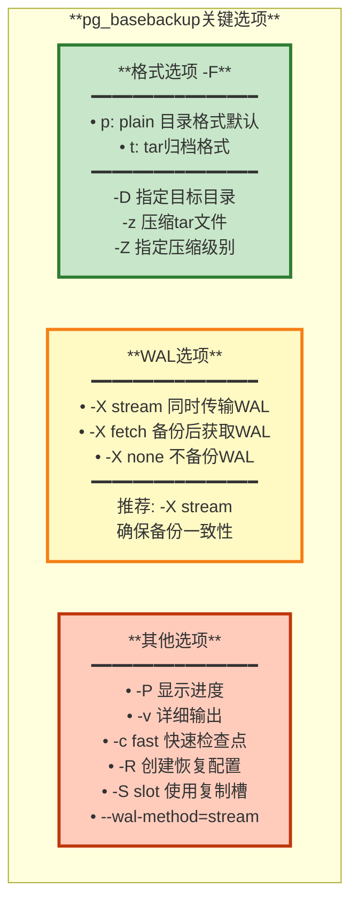

**常用命令**:
```bash
# 标准物理备份
pg_basebackup -h primary_host -D /backup -F p -X stream -P

# 压缩tar格式备份
pg_basebackup -h primary_host -D /backup -F t -z -X stream -P

# 创建备库（自动生成配置）
pg_basebackup -h primary_host -D /standby -X stream -R -P

# 使用复制槽
pg_basebackup -h primary_host -D /backup -X stream -S my_slot -P
```

### 3.3 文件系统级备份

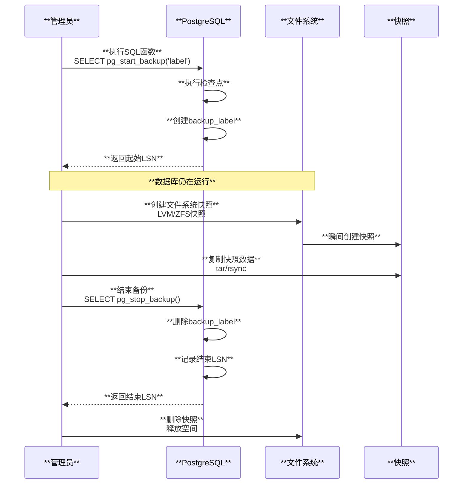

**LVM快照备份示例**:
```bash
# 1. 开始备份
psql -c "SELECT pg_start_backup('snapshot-backup', true)"

# 2. 创建LVM快照
lvcreate -L 10G -s -n pg_snap /dev/vg0/pg_data

# 3. 挂载快照
mount /dev/vg0/pg_snap /mnt/snapshot

# 4. 复制数据
tar -czf /backup/pgdata.tar.gz -C /mnt/snapshot .

# 5. 结束备份
psql -c "SELECT pg_stop_backup()"

# 6. 卸载并删除快照
umount /mnt/snapshot
lvremove -f /dev/vg0/pg_snap
```

---

## 4. 流复制原理

流复制是PostgreSQL高可用的核心技术，通过WAL流实现主备同步。

### 4.1 流复制架构

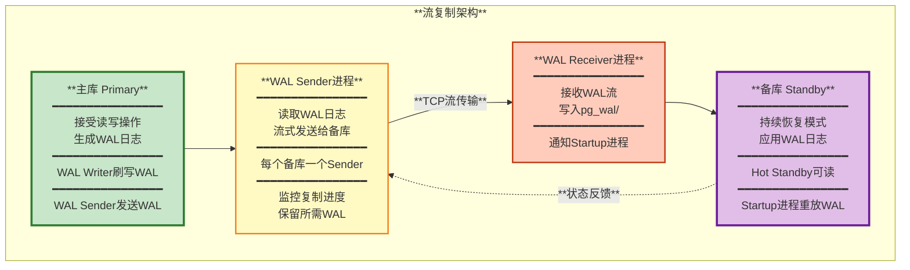

### 4.2 流复制配置

**主库配置**:
```ini
# postgresql.conf

# WAL级别必须为replica或logical
wal_level = replica

# 最大WAL Sender进程数
max_wal_senders = 10

# WAL保留大小（确保备库能追上）
wal_keep_size = 1GB  # 或 max_slot_wal_keep_size

# 异步复制提交延迟（0=立即发送）
wal_sender_timeout = 60s

# 启用归档（可选）
archive_mode = on
archive_command = 'cp %p /archive/%f'
```

**pg_hba.conf**:
```ini
# 允许备库连接（复制协议）
# TYPE  DATABASE    USER        ADDRESS         METHOD
host    replication replicator  standby_ip/32   md5
```

**备库配置**:
```ini
# postgresql.conf

# Hot Standby允许只读查询
hot_standby = on

# 恢复时的冲突处理
hot_standby_feedback = on

# 连接主库配置
primary_conninfo = 'host=primary_host port=5432 user=replicator password=xxx'

# 触发文件升级为主库（可选）
promote_trigger_file = '/tmp/promote'
```

**启动备库**:
```bash
# 1. 基础备份
pg_basebackup -h primary_host -D /var/lib/pgsql/data -X stream -P -R

# 2. 创建standby.signal文件
touch /var/lib/pgsql/data/standby.signal

# 3. 启动备库
pg_ctl start -D /var/lib/pgsql/data
```

### 4.3 同步复制

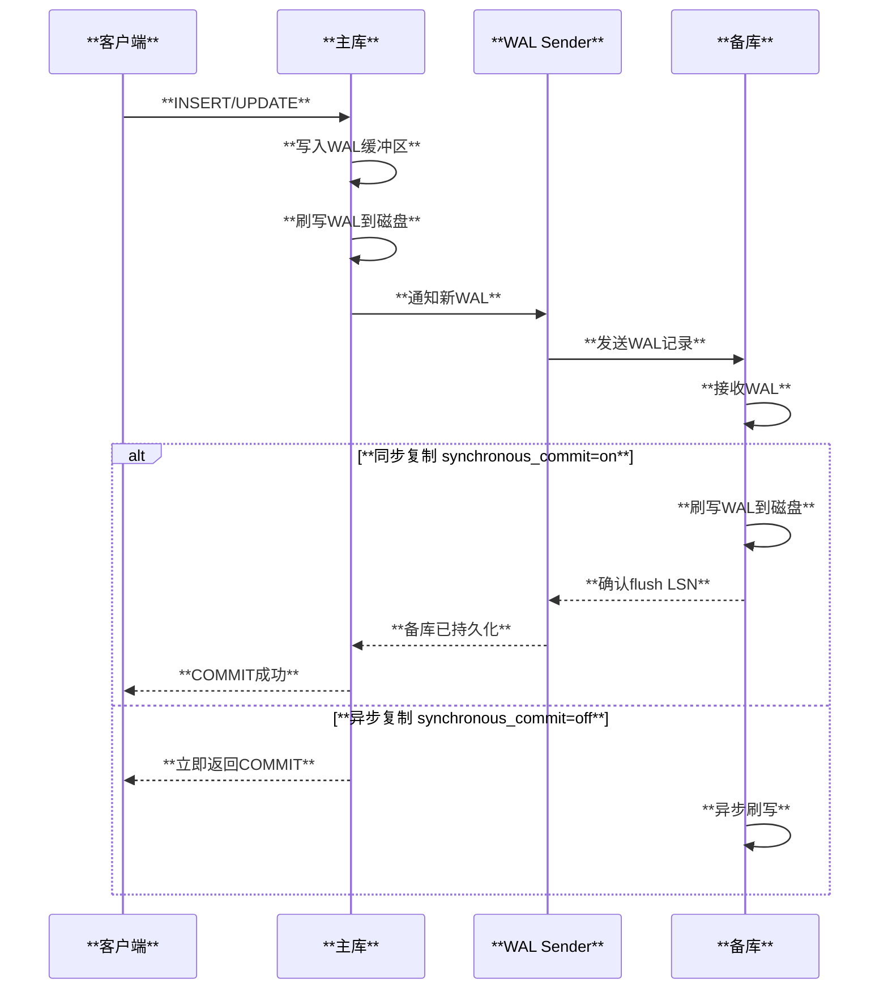

**同步级别**:
| **synchronous_commit** | **说明** | **性能** | **可靠性** |
|------------------------|---------|---------|-----------|
| **off** | 不等待WAL刷盘 | 最快 | 最低（可能丢数据） |
| **local** | 只等待本地刷盘 | 快 | 中等（备库可能落后） |
| **remote_write** | 等待备库写入OS缓存 | 中等 | 中等 |
| **on默认** | 等待备库刷写磁盘 | 慢 | 高 |
| **remote_apply** | 等待备库应用WAL | 最慢 | 最高（备库实时一致） |

**配置同步备库**:
```ini
# 主库 postgresql.conf

# 同步备库名称（在备库的application_name）
synchronous_standby_names = 'standby1'

# 多个备库：任一个确认即可
synchronous_standby_names = 'ANY 1 (standby1, standby2)'

# 多个备库：必须全部确认
synchronous_standby_names = 'FIRST 2 (standby1, standby2, standby3)'
```

---

## 5. 逻辑复制

逻辑复制基于**发布/订阅**模型，复制表级别的数据变更。

### 5.1 逻辑复制架构

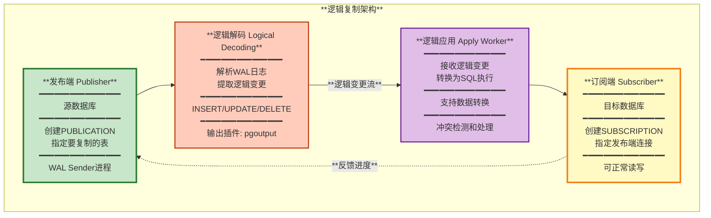

### 5.2 逻辑复制vs物理复制

| **特性** | **物理复制** | **逻辑复制** |
|---------|------------|------------|
| **复制粒度** | 整个实例 | 表级别 |
| **版本要求** | 必须相同大版本 | 可跨版本 |
| **备库可写** | 否（只读） | 是（正常读写） |
| **复制延迟** | 毫秒级 | 秒级 |
| **数据转换** | 不支持 | 支持（触发器） |
| **DDL复制** | 自动 | 不复制DDL |
| **冲突处理** | 无冲突 | 需要处理冲突 |
| **资源消耗** | 低 | 高（需要应用SQL） |

### 5.3 逻辑复制配置

**发布端**:
```sql
-- 1. 设置WAL级别
ALTER SYSTEM SET wal_level = logical;
SELECT pg_reload_conf();

-- 2. 创建发布用户
CREATE ROLE replication_user WITH REPLICATION LOGIN PASSWORD 'password';

-- 3. 授权
GRANT SELECT ON ALL TABLES IN SCHEMA public TO replication_user;

-- 4. 创建发布
CREATE PUBLICATION my_publication FOR TABLE users, orders;

-- 或发布所有表
CREATE PUBLICATION all_tables FOR ALL TABLES;

-- 查看发布
SELECT * FROM pg_publication;
```

**订阅端**:
```sql
-- 1. 创建同结构的表（逻辑复制不复制DDL）
CREATE TABLE users (...);
CREATE TABLE orders (...);

-- 2. 创建订阅
CREATE SUBSCRIPTION my_subscription
    CONNECTION 'host=publisher_host dbname=mydb user=replication_user password=xxx'
    PUBLICATION my_publication;

-- 查看订阅
SELECT * FROM pg_subscription;

-- 查看订阅状态
SELECT * FROM pg_stat_subscription;
```

### 5.4 逻辑复制冲突处理

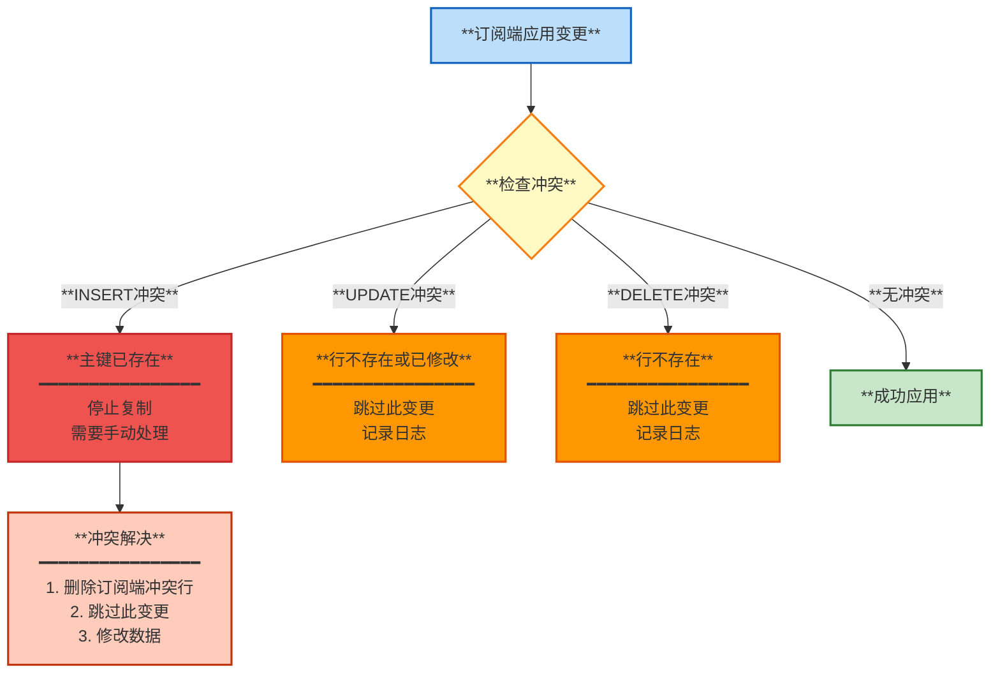

**冲突解决示例**:
```sql
-- 查看冲突
SELECT * FROM pg_stat_subscription_stats;

-- 跳过冲突的事务
SELECT pg_replication_origin_advance('pg_16385', '0/12345678');

-- 删除并重新创建订阅
DROP SUBSCRIPTION my_subscription;
CREATE SUBSCRIPTION my_subscription ...;
```

---

## 6. 复制槽

复制槽（Replication Slot）确保主库保留备库需要的WAL日志。

### 6.1 复制槽原理

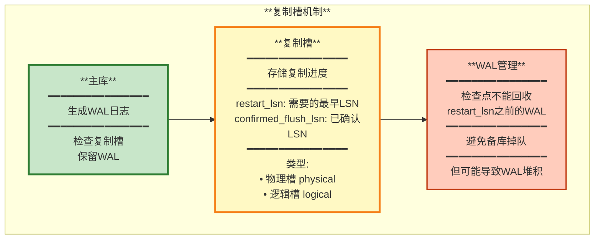

### 6.2 复制槽管理

**创建复制槽**:
```sql
-- 物理复制槽
SELECT * FROM pg_create_physical_replication_slot('standby_slot');

-- 逻辑复制槽
SELECT * FROM pg_create_logical_replication_slot('logical_slot', 'pgoutput');

-- 查看复制槽
SELECT slot_name, slot_type, active, restart_lsn, 
       confirmed_flush_lsn, wal_status
FROM pg_replication_slots;
```

**使用复制槽**:
```ini
# 备库配置 postgresql.conf
primary_slot_name = 'standby_slot'
```

**删除复制槽**:
```sql
-- 只能在主库删除
SELECT pg_drop_replication_slot('standby_slot');
```

### 6.3 WAL堆积监控

```sql
-- 监控WAL堆积
SELECT slot_name,
       pg_size_pretty(pg_wal_lsn_diff(pg_current_wal_lsn(), restart_lsn)) AS retained_wal,
       active
FROM pg_replication_slots;

-- 检查WAL目录大小
SELECT pg_size_pretty(sum(size)) AS wal_size
FROM pg_ls_waldir();

-- 设置WAL保留上限（避免磁盘撑满）
ALTER SYSTEM SET max_slot_wal_keep_size = '10GB';
```

---

## 总结

PostgreSQL的备份和复制机制提供了完整的数据保护和高可用方案：

1. **逻辑备份**: pg_dump/pg_dumpall，适合小型数据库和跨版本迁移
2. **物理备份**: pg_basebackup，大型数据库的标准备份方法
3. **流复制**: 基于WAL流的物理复制，实现主备高可用
4. **逻辑复制**: 表级别的发布/订阅复制，支持跨版本和数据转换
5. **复制槽**: 确保复制所需WAL不被回收

**最佳实践**:
- 生产环境：物理备份 + WAL归档 + 流复制
- 定期备份：pg_basebackup + cron
- 高可用：主库 + 同步备库 + 异步备库
- 灾备：异地归档 + 定期演练恢复

**监控指标**:
- `pg_stat_replication`: 流复制状态
- `pg_stat_subscription`: 逻辑复制状态
- `pg_replication_slots`: 复制槽状态
- WAL生成速率和归档延迟

---

**相关文档**:
- [04-WAL和崩溃恢复](./04-WAL和崩溃恢复.md)
- [08-高可用方案](./08-高可用方案.md)
- [10-使用场景和案例](./10-使用场景和案例.md)

