# PostgreSQL 高可用方案

## 目录
- [1. 高可用概述](#1-高可用概述)
- [2. 主备架构](#2-主备架构)
- [3. 自动故障切换](#3-自动故障切换)
- [4. 读写分离](#4-读写分离)
- [5. 连接池方案](#5-连接池方案)
- [6. 高可用方案对比](#6-高可用方案对比)

---

## 1. 高可用概述

高可用（High Availability, HA）指系统能够持续运行的能力，通常用**可用性百分比**衡量。

### 1.1 可用性等级


### 1.2 高可用组件

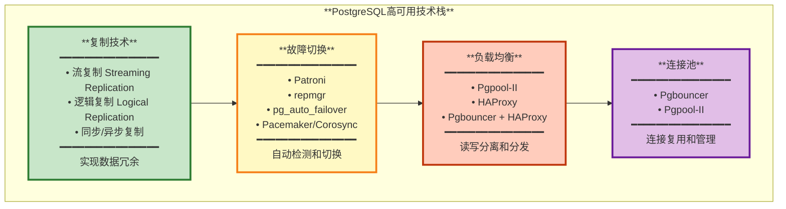

---

## 2. 主备架构

### 2.1 典型主备架构

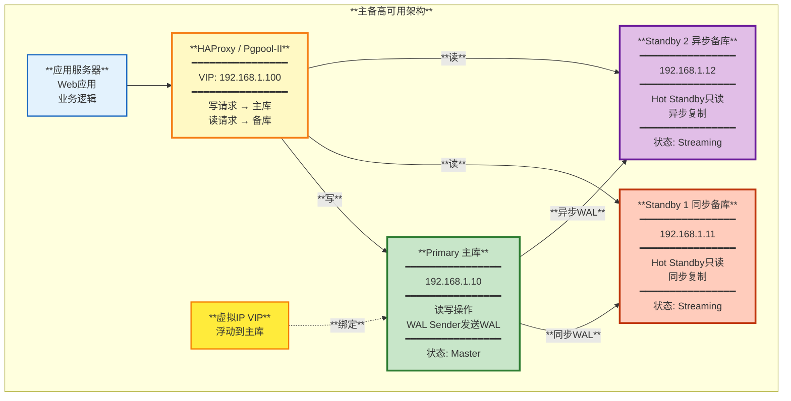

### 2.2 主备配置详解

**主库配置 postgresql.conf**:
```ini
# 监听地址
listen_addresses = '*'

# WAL配置
wal_level = replica
max_wal_senders = 10
wal_keep_size = 1GB

# 同步复制
synchronous_commit = on
synchronous_standby_names = 'standby1'

# 归档（可选）
archive_mode = on
archive_command = 'cp %p /archive/%f'

# 复制槽（推荐）
max_replication_slots = 10
```

**主库 pg_hba.conf**:
```ini
# 允许备库复制连接
host    replication     replicator      192.168.1.0/24      md5
```

**备库配置 postgresql.conf**:
```ini
# Hot Standby
hot_standby = on
hot_standby_feedback = on

# 主库连接信息
primary_conninfo = 'host=192.168.1.10 port=5432 user=replicator password=xxx application_name=standby1'

# 复制槽
primary_slot_name = 'standby1_slot'

# 恢复配置
restore_command = 'cp /archive/%f %p'  # 如果启用归档
```

**备库 standby.signal**:
```bash
# 创建此文件标识为备库
touch $PGDATA/standby.signal
```

---

## 3. 自动故障切换

### 3.1 Patroni架构

Patroni是目前最流行的PostgreSQL自动故障切换解决方案。

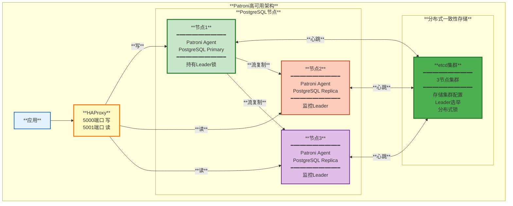

### 3.2 Patroni故障切换流程

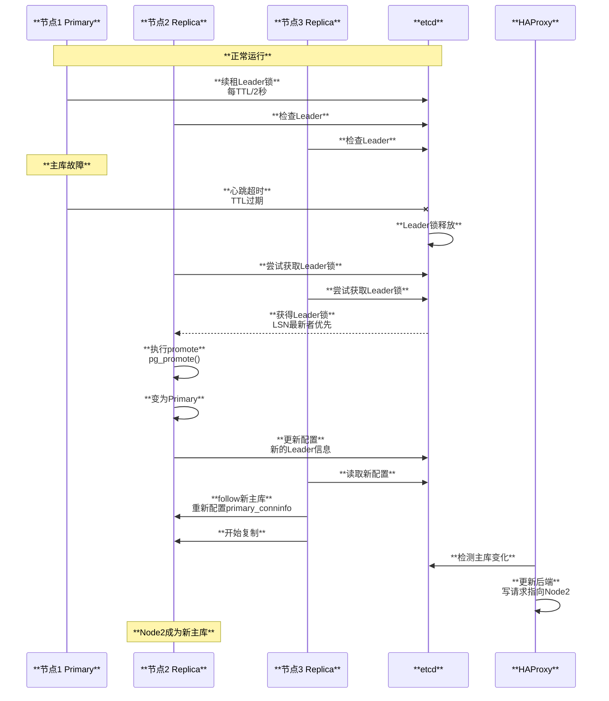

### 3.3 Patroni配置示例

**patroni.yml**:
```yaml
scope: postgres_cluster
namespace: /service/
name: node1

restapi:
  listen: 0.0.0.0:8008
  connect_address: 192.168.1.10:8008

etcd:
  hosts:
    - 192.168.1.20:2379
    - 192.168.1.21:2379
    - 192.168.1.22:2379

bootstrap:
  dcs:
    ttl: 30
    loop_wait: 10
    retry_timeout: 10
    maximum_lag_on_failover: 1048576  # 1MB
    
    postgresql:
      use_pg_rewind: true
      parameters:
        wal_level: replica
        hot_standby: on
        max_wal_senders: 10
        max_replication_slots: 10
        synchronous_commit: on

postgresql:
  listen: 0.0.0.0:5432
  connect_address: 192.168.1.10:5432
  data_dir: /var/lib/postgresql/data
  bin_dir: /usr/lib/postgresql/15/bin
  
  authentication:
    replication:
      username: replicator
      password: repl_password
    superuser:
      username: postgres
      password: postgres_password
  
  parameters:
    max_connections: 200
    shared_buffers: 256MB

tags:
  nofailover: false
  noloadbalance: false
  clonefrom: false
  nosync: false
```

### 3.4 其他故障切换方案

#### **repmgr**
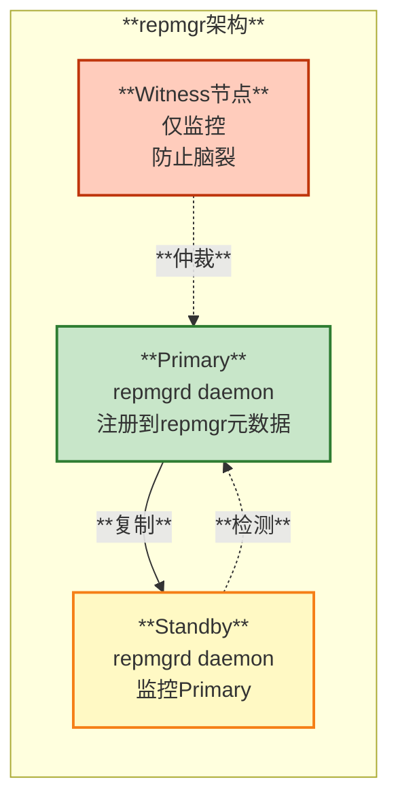

**特点**:
- 轻量级，不需要外部分布式存储
- 使用数据库自身存储元数据
- 需要Witness节点防止脑裂

#### **pg_auto_failover**
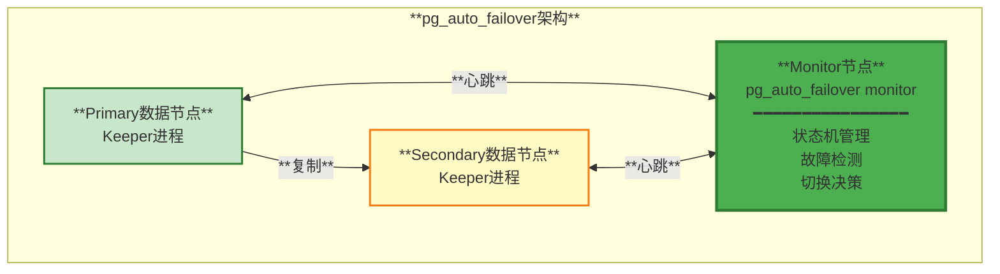

**特点**:
- Citus官方开发
- 简单易用
- 状态机驱动
- 单Monitor节点（可能成为单点）

---

## 4. 读写分离

### 4.1 Pgpool-II架构

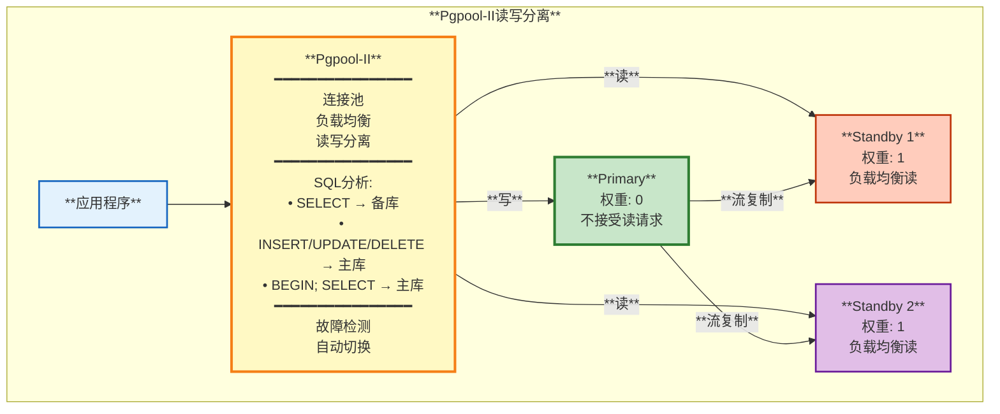

### 4.2 Pgpool-II配置

**pgpool.conf关键配置**:
```ini
# 后端PostgreSQL配置
backend_hostname0 = '192.168.1.10'
backend_port0 = 5432
backend_weight0 = 0  # 主库不参与读负载均衡
backend_flag0 = 'ALWAYS_PRIMARY'

backend_hostname1 = '192.168.1.11'
backend_port1 = 5432
backend_weight1 = 1
backend_flag1 = 'DISALLOW_TO_FAILOVER'

backend_hostname2 = '192.168.1.12'
backend_port2 = 5432
backend_weight2 = 1

# 负载均衡
load_balance_mode = on
statement_level_load_balance = on

# 连接池
connection_cache = on
max_pool = 32
child_max_connections = 100
num_init_children = 32

# 健康检查
health_check_period = 10
health_check_timeout = 5
health_check_max_retries = 3

# 故障切换
failover_on_backend_error = on
failover_command = '/etc/pgpool/failover.sh %d %h %p %D %m %H %M %P %r %R %N %S'

# 在线恢复
recovery_user = 'postgres'
recovery_1st_stage_command = 'recovery_1st_stage'
```

### 4.3 HAProxy读写分离

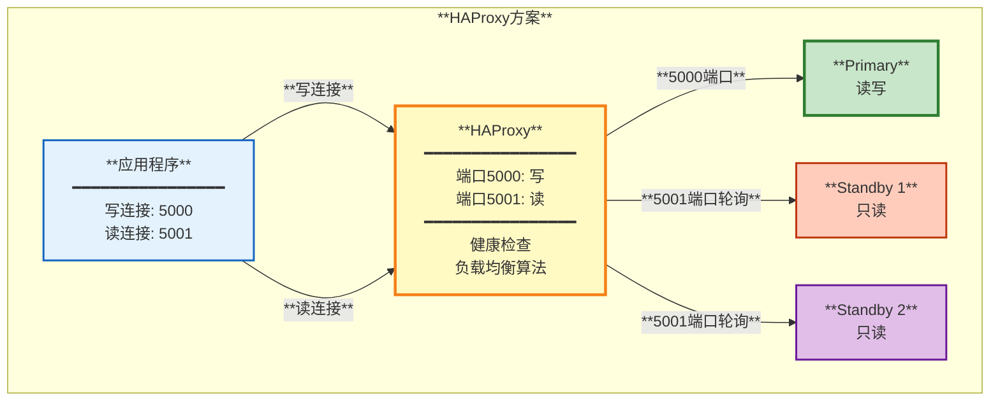

**haproxy.cfg**:
```cfg
global
    maxconn 10000

defaults
    mode tcp
    timeout connect 5s
    timeout client 60s
    timeout server 60s

# 写入端口
listen postgres_write
    bind *:5000
    option pgsql-check user haproxy
    server primary 192.168.1.10:5432 check

# 读取端口（负载均衡）
listen postgres_read
    bind *:5001
    balance roundrobin
    option pgsql-check user haproxy
    server standby1 192.168.1.11:5432 check
    server standby2 192.168.1.12:5432 check

# 监控页面
listen stats
    bind *:7000
    stats enable
    stats uri /
```

**健康检查脚本**:
```sql
-- 创建健康检查用户
CREATE USER haproxy;

-- 主库检查（是否可写）
SELECT NOT pg_is_in_recovery();

-- 备库检查（是否在恢复中）
SELECT pg_is_in_recovery();
```

---

## 5. 连接池方案

### 5.1 Pgbouncer架构

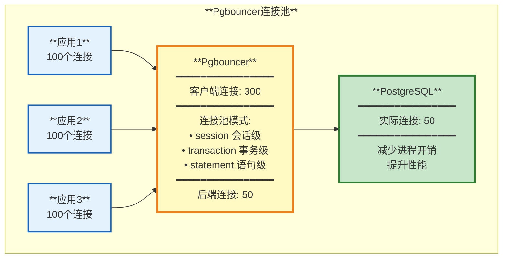

### 5.2 连接池模式对比

| **模式** | **连接复用** | **事务安全** | **功能限制** | **性能** | **适用场景** |
|---------|------------|------------|------------|---------|------------|
| **session** | 会话结束后 | 完全安全 | 无限制 | 低 | 需要临时表、预处理语句 |
| **transaction** | 事务结束后 | 安全 | 不支持SET等会话状态 | 高 | 大部分应用推荐 |
| **statement** | 每条语句后 | 不安全 | 不支持多语句事务 | 最高 | 只读查询 |

### 5.3 Pgbouncer配置

**pgbouncer.ini**:
```ini
[databases]
mydb = host=192.168.1.10 port=5432 dbname=mydb

[pgbouncer]
# 监听配置
listen_addr = *
listen_port = 6432

# 认证
auth_type = md5
auth_file = /etc/pgbouncer/userlist.txt

# 连接池模式
pool_mode = transaction

# 连接池大小
max_client_conn = 1000
default_pool_size = 25
reserve_pool_size = 5
reserve_pool_timeout = 3

# 连接限制
max_db_connections = 100
max_user_connections = 100

# 日志
log_connections = 1
log_disconnections = 1
log_pooler_errors = 1

# 管理
admin_users = admin
stats_users = stats
```

**userlist.txt**:
```
"user1" "md5hashed_password"
"user2" "md5hashed_password"
```

---

## 6. 高可用方案对比

### 6.1 方案对比表

| **方案** | **自动切换** | **复杂度** | **依赖** | **性能影响** | **适用场景** |
|---------|------------|----------|---------|------------|------------|
| **手动主备** | ❌ | 低 | 无 | 无 | 测试环境 |
| **Patroni** | ✅ | 中 | etcd/Consul/Zookeeper | 低 | **生产推荐** |
| **repmgr** | ✅ | 中 | Witness节点 | 低 | 中小型部署 |
| **pg_auto_failover** | ✅ | 低 | Monitor节点 | 低 | 简单场景 |
| **Pgpool-II** | ✅ | 高 | Watchdog | 中 | 需要连接池和读写分离 |
| **Pacemaker** | ✅ | 高 | Corosync | 低 | 传统HA环境 |

### 6.2 推荐架构

**小型环境（< 10 TPS）**:


**中型环境（10-100 TPS）**:
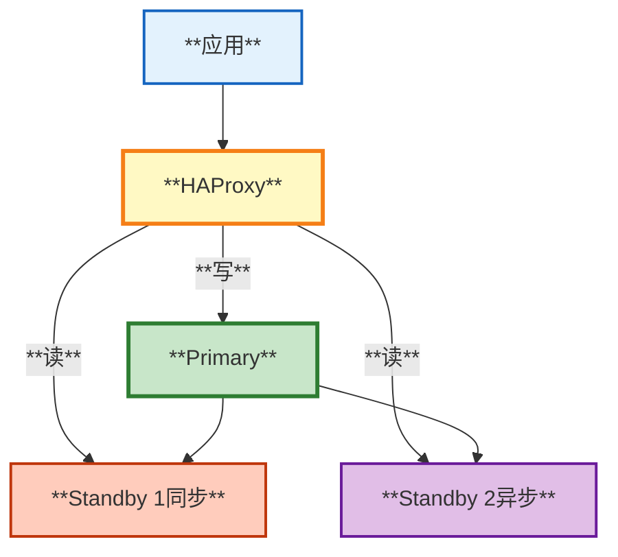

**大型环境（> 100 TPS）**:
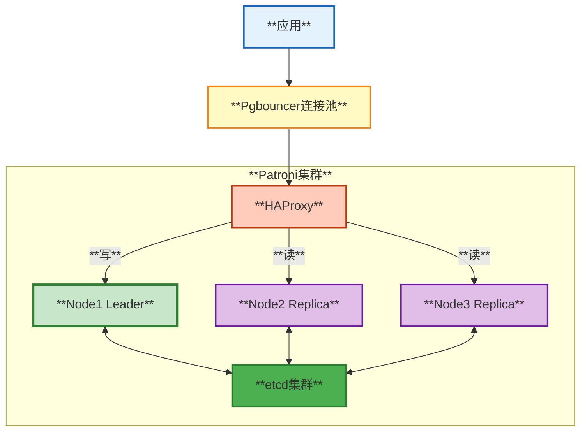

---

## 总结

PostgreSQL高可用方案的选择需要综合考虑业务需求、团队能力和成本：

1. **核心组件**:
   - 流复制：数据冗余基础
   - 故障检测：自动切换关键
   - 负载均衡：提升性能
   - 连接池：降低开销

2. **方案选择**:
   - **生产环境推荐**: Patroni + etcd + HAProxy + Pgbouncer
   - **轻量级方案**: pg_auto_failover
   - **传统方案**: repmgr + HAProxy

3. **最佳实践**:
   - 至少1主2从（1同步1异步）
   - 使用复制槽防止WAL丢失
   - 监控复制延迟和健康状态
   - 定期演练故障切换
   - 完善的监控和告警

4. **关键指标**:
   - RTO（恢复时间目标）：< 1分钟
   - RPO（恢复点目标）：< 10秒
   - 复制延迟：< 100ms
   - 故障检测时间：< 30秒

---

**相关文档**:
- [07-备份和复制原理](./07-备份和复制原理.md)
- [09-网络模型和进程架构](./09-网络模型和进程架构.md)
- [10-使用场景和案例](./10-使用场景和案例.md)

