# PostgreSQL 网络模型和进程架构

## 目录
- [1. 网络模型概述](#1-网络模型概述)
- [2. 连接建立流程](#2-连接建立流程)
- [3. 前后端协议](#3-前后端协议)
- [4. 进程间通信](#4-进程间通信)
- [5. 并发处理模型](#5-并发处理模型)

---

## 1. 网络模型概述

PostgreSQL采用**多进程模型**，每个客户端连接对应一个独立的Backend进程。

### 1.1 整体网络架构

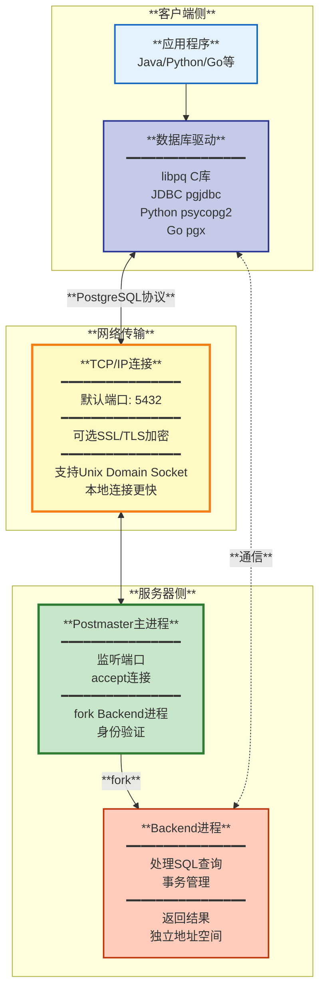

### 1.2 多进程vs多线程

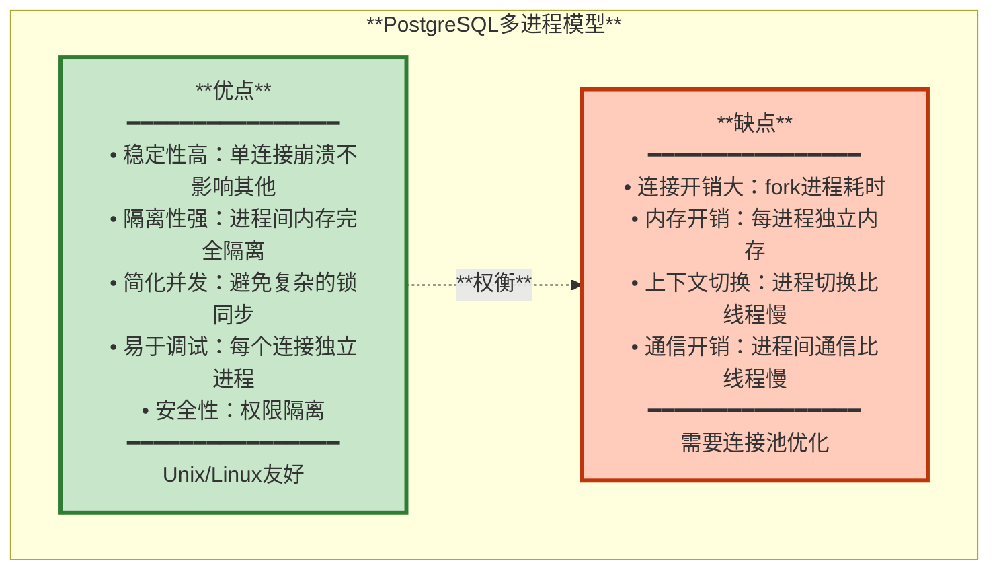

**对比其他数据库**:
| **数据库** | **并发模型** | **说明** |
|-----------|------------|---------|
| **PostgreSQL** | 多进程 | 每连接一个进程 |
| **MySQL** | 多线程 | 线程池模型 |
| **Oracle** | 多进程/多线程 | 可配置，Windows上用线程 |
| **SQL Server** | 多线程 | Windows原生线程池 |

---

## 2. 连接建立流程

### 2.1 完整连接流程

```mermaid
sequenceDiagram
    participant Client as **客户端**
    participant Postmaster as **Postmaster**
    participant Backend as **Backend进程**
    participant Auth as **身份验证**
    participant DB as **数据库**
    
    Client->>Postmaster: **1. TCP三次握手**<br/>connect(5432)
    Postmaster-->>Client: **SYN-ACK**
    
    Client->>Postmaster: **2. 启动包 Startup Packet**<br/>━━━━━━━━━━━━━━━━<br/>协议版本: 3.0<br/>database: mydb<br/>user: postgres<br/>application_name: myapp<br/>client_encoding: UTF8
    
    Postmaster->>Postmaster: **3. 检查连接限制**<br/>max_connections<br/>superuser_reserved_connections
    
    alt **连接数已满**
        Postmaster-->>Client: **ERROR: too many connections**
    else **有空闲槽位**
        Postmaster->>Backend: **4. Fork新进程**<br/>继承共享内存<br/>独立地址空间
        
        Backend->>Backend: **5. 初始化Backend状态**<br/>设置信号处理器<br/>初始化内存上下文
        
        Backend->>Auth: **6. 身份验证流程**
        
        alt **md5认证**
            Auth-->>Client: **AuthenticationMD5Password**<br/>发送salt
            Client->>Auth: **MD5哈希密码**
            Auth->>Auth: **校验密码**
        else **SCRAM-SHA-256**
            Auth-->>Client: **AuthenticationSASL**
            Client<->>Auth: **SCRAM握手**
        else **peer认证**
            Auth->>Auth: **检查Unix用户名**
        end
        
        alt **认证失败**
            Auth-->>Client: **ERROR: authentication failed**
        else **认证成功**
            Auth-->>Client: **AuthenticationOk**
            
            Backend->>DB: **7. 连接数据库**<br/>加载pg_database元数据<br/>初始化会话状态
            
            Backend-->>Client: **8. 发送Ready消息**<br/>━━━━━━━━━━━━━━━━<br/>ReadyForQuery<br/>事务状态: Idle<br/>━━━━━━━━━━━━━━━━<br/>服务器版本<br/>参数状态<br/>字符编码等
            
            Note over Client,Backend: **连接建立完成**
        end
    end
```

### 2.2 启动包（Startup Packet）

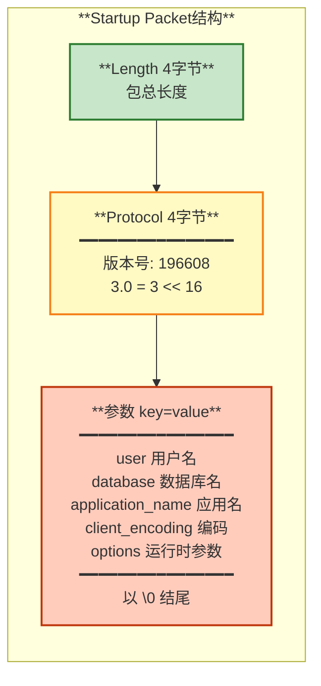

### 2.3 认证方法

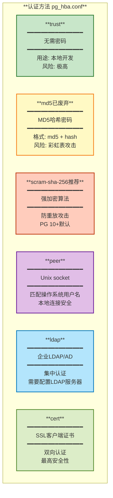

**pg_hba.conf示例**:
```ini
# TYPE  DATABASE    USER        ADDRESS         METHOD

# 本地Unix socket连接
local   all         all                         peer

# 本地回环IPv4
host    all         all         127.0.0.1/32    scram-sha-256

# 本地回环IPv6
host    all         all         ::1/128         scram-sha-256

# 内网连接
host    all         all         192.168.1.0/24  scram-sha-256

# 复制连接
host    replication replicator  192.168.1.0/24  scram-sha-256

# SSL连接
hostssl all         all         0.0.0.0/0       cert
```

---

## 3. 前后端协议

PostgreSQL使用自定义的**消息协议**进行通信。

### 3.1 协议消息类型

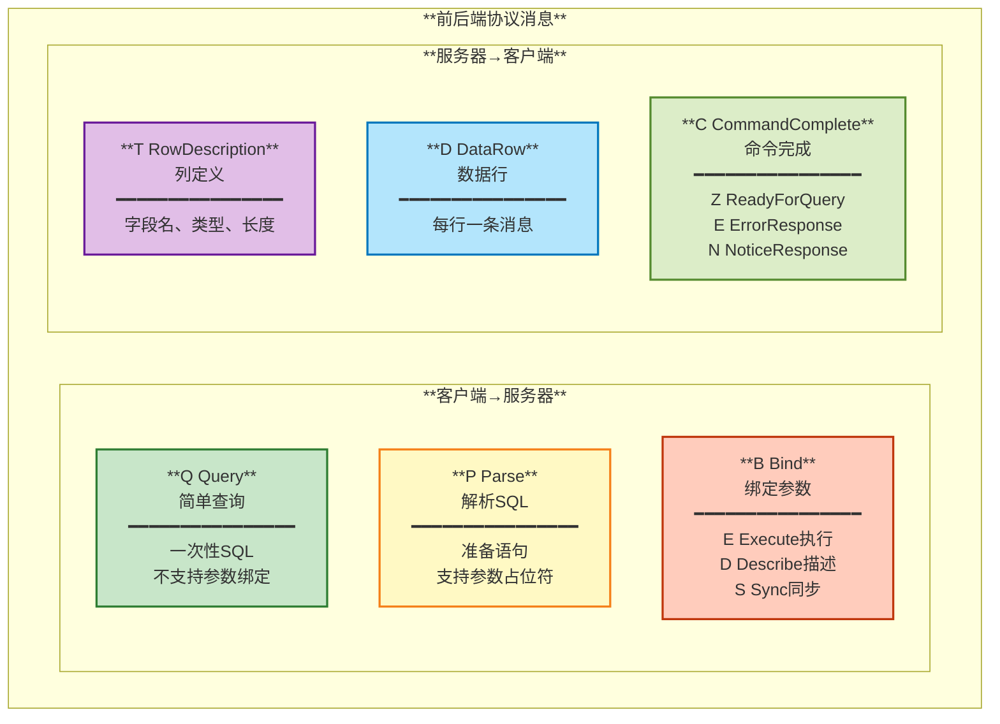

### 3.2 简单查询流程

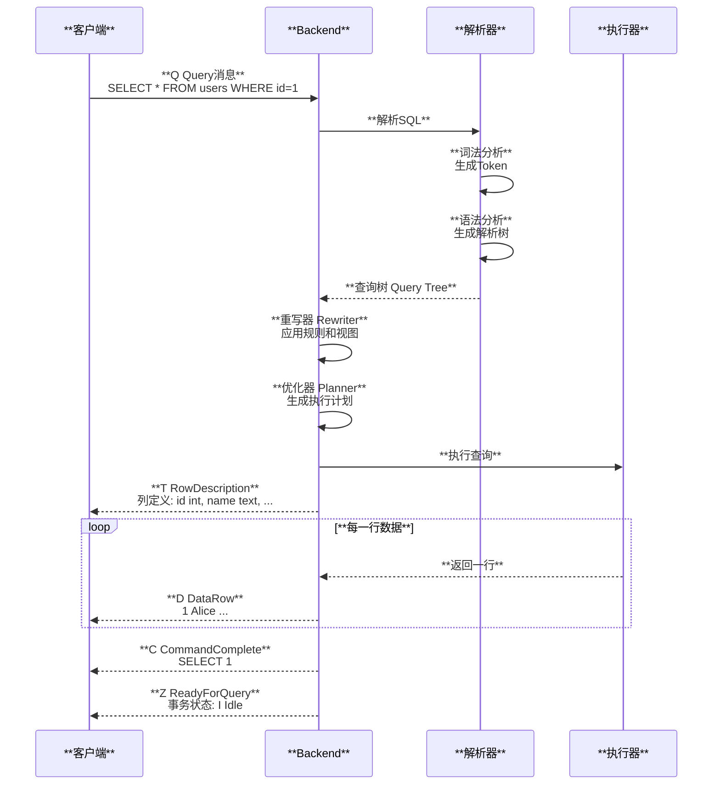

### 3.3 扩展查询流程（Prepared Statement）

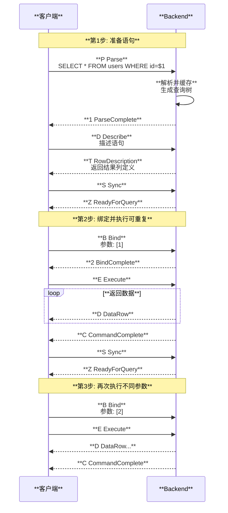

**扩展查询优点**:
- 避免重复解析SQL
- 防止SQL注入（参数化查询）
- 二进制传输参数（性能更好）

---

## 4. 进程间通信

### 4.1 共享内存

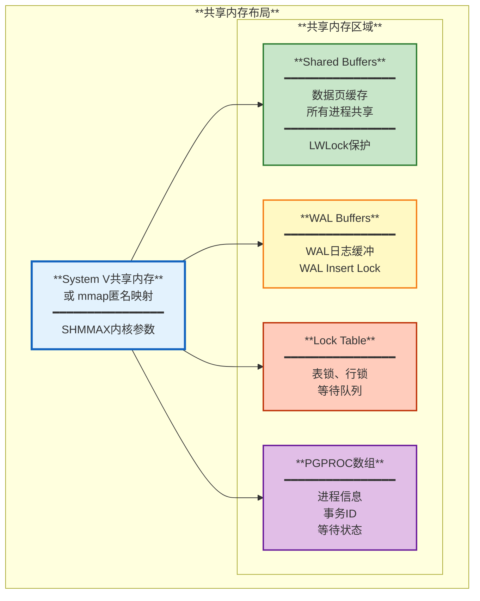

### 4.2 信号量（Semaphore）

PostgreSQL使用信号量进行进程同步：

| **信号量类型** | **用途** | **说明** |
|--------------|---------|---------|
| **PGSemaphore** | 进程等待 | 等待锁、IO完成等 |
| **LWLock** | 轻量级锁 | 保护共享数据结构 |
| **Spinlock** | 自旋锁 | 极短临界区，忙等待 |

**LWLock模式**:
- `LW_SHARED`: 共享锁（读）
- `LW_EXCLUSIVE`: 排他锁（写）

**关键LWLock**:
- `BufMappingLock`: 缓冲区映射表
- `WALInsertLock`: WAL插入
- `ProcArrayLock`: 进程数组
- `CLogControlLock`: CLOG控制

### 4.3 Latch机制

**Latch**是PostgreSQL的事件等待机制。

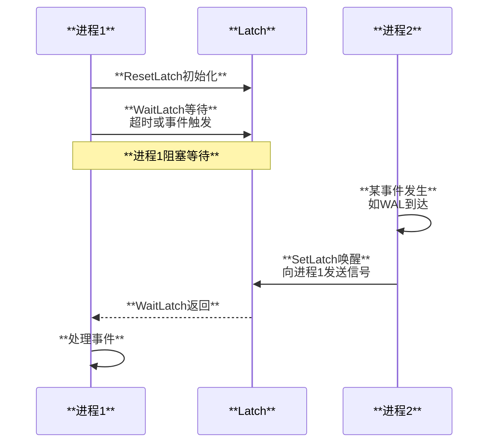

**Latch用途**:
- WAL Receiver等待新WAL
- Backend等待锁释放
- Autovacuum等待触发
- 后台进程定时唤醒

---

## 5. 并发处理模型

### 5.1 连接数限制

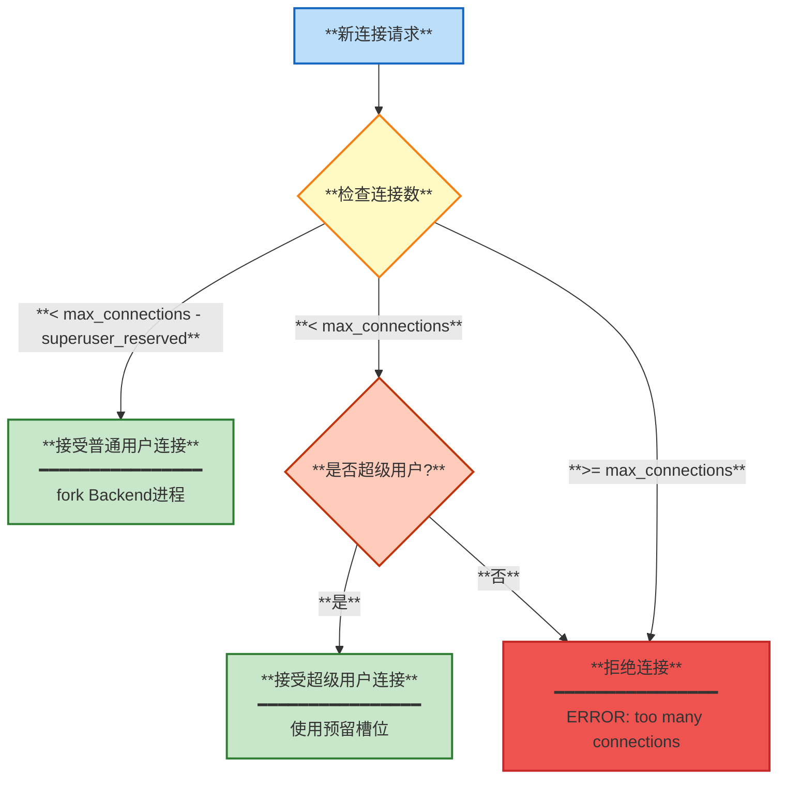

**配置参数**:
```ini
# postgresql.conf

# 最大连接数（包括超级用户预留）
max_connections = 100

# 超级用户预留连接数
superuser_reserved_connections = 3

# 实际可用连接 = 100 - 3 = 97
```

### 5.2 连接池必要性

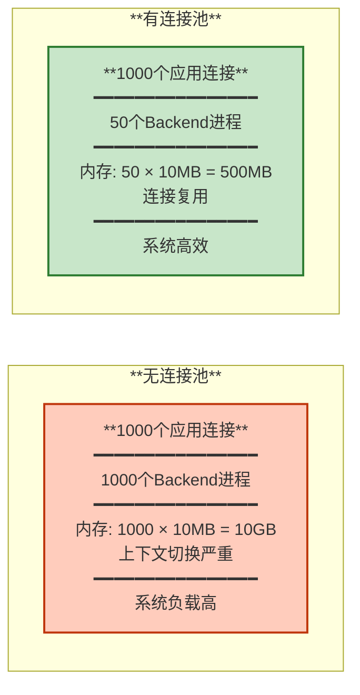

**连接池配置建议**:
```
连接池大小 = ((核心数 × 2) + 有效磁盘数)
```

示例：
- 8核CPU + 2块磁盘 = (8 × 2) + 2 = 18个连接

### 5.3 性能调优

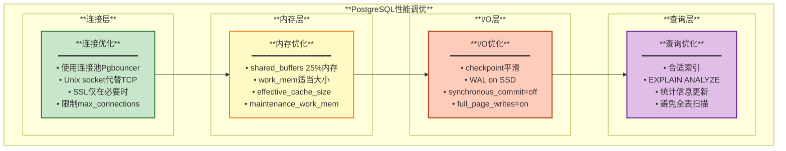

---

## 总结

PostgreSQL的网络模型和进程架构体现了其设计哲学：

1. **多进程模型**:
   - 优点：稳定性高、隔离性强、易于调试
   - 缺点：连接开销大、需要连接池

2. **前后端协议**:
   - 基于TCP/IP
   - 消息驱动
   - 支持简单查询和扩展查询（Prepared Statement）

3. **进程间通信**:
   - 共享内存：数据共享
   - 信号量：进程同步
   - Latch：事件通知

4. **并发处理**:
   - 连接数限制
   - 连接池必要性
   - 性能调优

**最佳实践**:
- 生产环境必用连接池（Pgbouncer）
- 合理配置max_connections（50-100）
- Unix socket本地连接
- 监控连接数和慢查询

**监控指标**:
- `pg_stat_activity`: 当前连接和查询
- `pg_stat_database`: 数据库连接统计
- 连接数/max_connections比率
- Backend进程CPU和内存使用

---

**相关文档**:
- [01-架构总览](./01-架构总览.md)
- [05-连接池方案](./08-高可用方案.md#5-连接池方案)
- [10-使用场景和案例](./10-使用场景和案例.md)

